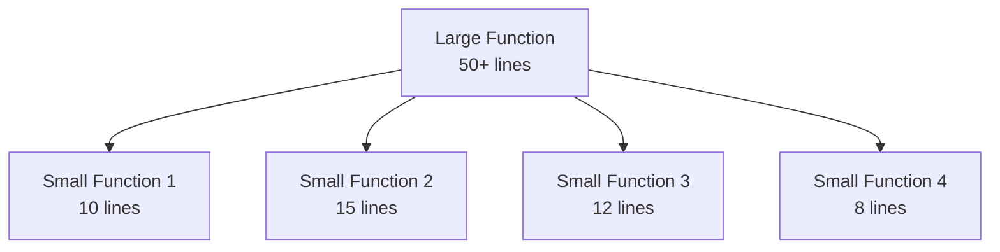
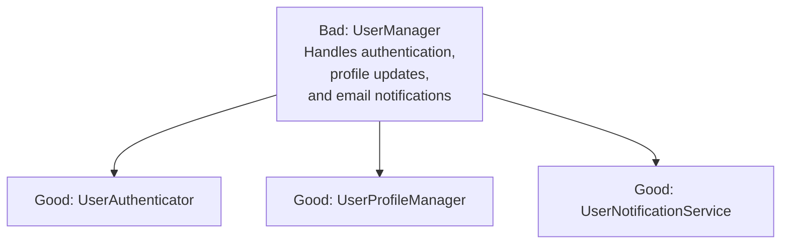
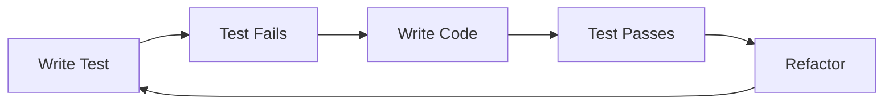

# Clean Code Principles: Writing Code That Lasts

## Introduction

Code is read far more often than it is written. Whether you're working on a personal project or as part of a large team, writing clean, maintainable code is essential for long-term success. Clean code isn't just about aesthetics—it's about creating software that can be understood, modified, and extended with minimal friction.

This article explores key principles and practices for writing clean code that stands the test of time.

## What Makes Code "Clean"?

Clean code is:

- **Readable**: Easy to understand by other developers (and your future self)
- **Simple**: Solves problems without unnecessary complexity
- **Maintainable**: Can be modified without fear of breaking other parts
- **Testable**: Structured in a way that enables thorough testing
- **Expressive**: Clearly communicates its intent

## Naming Conventions

> "There are only two hard things in Computer Science: cache invalidation and naming things." — Phil Karlton

### Use Intention-Revealing Names

Names should tell you why something exists, what it does, and how it's used.

```javascript
// Poor naming
const d = new Date(); // d doesn't tell us anything
let x = 5; // What does x represent?
function calc() { /* ... */ } // What is being calculated?

// Clean naming
const currentDate = new Date();
let numberOfAttempts = 5;
function calculateTotalPrice() { /* ... */ }
```

### Use Pronounceable Names

Code is discussed verbally, so use names that can be pronounced.

```python
# Hard to pronounce
cndtn = True
yyyymmdstr = "20230815"

# Easy to pronounce
condition = True
dateFormatted = "20230815"
```

### Use Searchable Names

Avoid single-letter names and numeric constants without context.

```java
// Hard to search
for (int i = 0; i < 7; i++) {
    // Do something 7 times
}

// Easy to search
final int DAYS_IN_WEEK = 7;
for (int dayIndex = 0; dayIndex < DAYS_IN_WEEK; dayIndex++) {
    // Do something for each day
}
```

## Functions and Methods

### Do One Thing

Functions should do one thing, do it well, and do it only.

```javascript
// Function doing multiple things
function validateAndSaveUser(user) {
    // Validate email
    if (!user.email.includes('@')) {
        throw new Error('Invalid email');
    }
    
    // Validate age
    if (user.age < 18) {
        throw new Error('User must be at least 18 years old');
    }
    
    // Save to database
    database.save(user);
    
    // Send welcome email
    emailService.sendWelcomeEmail(user.email);
}

// Clean approach: separate functions for each responsibility
function validateUser(user) {
    validateUserEmail(user.email);
    validateUserAge(user.age);
}

function validateUserEmail(email) {
    if (!email.includes('@')) {
        throw new Error('Invalid email');
    }
}

function validateUserAge(age) {
    if (age < 18) {
        throw new Error('User must be at least 18 years old');
    }
}

function saveUser(user) {
    validateUser(user);
    database.save(user);
}

function sendWelcomeEmail(email) {
    emailService.sendWelcomeEmail(email);
}

function registerUser(user) {
    saveUser(user);
    sendWelcomeEmail(user.email);
}
```

### Keep Functions Small

Smaller functions are easier to understand, test, and reuse.



### Minimize Arguments

Functions with fewer parameters are easier to understand and test.

```python
# Too many parameters
def create_user(name, email, age, address, phone, subscription_type, referral_code):
    # ...

# Better approach: use an object
def create_user(user_data):
    # ...

# Call site
create_user({
    "name": "John Doe",
    "email": "john@example.com",
    "age": 30,
    "address": "123 Main St",
    "phone": "555-1234",
    "subscription_type": "premium",
    "referral_code": "REF123"
})
```

### Avoid Side Effects

Functions should not have unexpected side effects.

```javascript
// Function with side effect
let totalPrice = 0;

function addItemToCart(item) {
    cart.push(item);
    // Side effect: modifying totalPrice which is outside the function's scope
    totalPrice += item.price;
}

// Better approach
function addItemToCart(cart, item) {
    return [...cart, item];
}

function calculateTotalPrice(cart) {
    return cart.reduce((total, item) => total + item.price, 0);
}
```

## Comments

### Good Comments Explain "Why", Not "What"

Code should be self-explanatory about what it does. Comments should explain why.

```java
// Poor comment: explains what the code does
// Increment i by 1
i++;

// Good comment: explains why
// We need to use a 1-based index because the API expects it
i++;
```

### Avoid Commented-Out Code

Version control systems are better for tracking code history.

```javascript
function calculateTotal(items) {
    // Bad: leaving commented code
    // let total = 0;
    // for (let i = 0; i < items.length; i++) {
    //     total += items[i].price;
    // }
    
    // Using reduce instead
    return items.reduce((total, item) => total + item.price, 0);
}
```

## Error Handling

### Use Exceptions Rather Than Return Codes

Exceptions make error handling code cleaner.

```java
// Using error codes
public int withdraw(Account account, int amount) {
    if (account == null) {
        return -1; // Error: invalid account
    }
    if (amount <= 0) {
        return -2; // Error: invalid amount
    }
    if (amount > account.getBalance()) {
        return -3; // Error: insufficient funds
    }
    
    account.debit(amount);
    return 0; // Success
}

// Using exceptions
public void withdraw(Account account, int amount) throws InvalidAccountException, InvalidAmountException, InsufficientFundsException {
    if (account == null) {
        throw new InvalidAccountException("Account cannot be null");
    }
    if (amount <= 0) {
        throw new InvalidAmountException("Amount must be positive");
    }
    if (amount > account.getBalance()) {
        throw new InsufficientFundsException("Insufficient funds for withdrawal");
    }
    
    account.debit(amount);
}
```

### Don't Return Null

Returning null forces callers to add null checks everywhere.

```java
// Returning null
public List<Customer> getCustomers() {
    if (database.isConnectionDown()) {
        return null; // Forcing caller to check for null
    }
    return database.getCustomers();
}

// Better: return empty collection
public List<Customer> getCustomers() {
    if (database.isConnectionDown()) {
        return Collections.emptyList();
    }
    return database.getCustomers();
}

// Or use Optional in Java
public Optional<Customer> findCustomer(String id) {
    Customer customer = database.findCustomer(id);
    return Optional.ofNullable(customer);
}
```

## Classes and Objects

### Single Responsibility Principle

A class should have only one reason to change.



### Open/Closed Principle

Software entities should be open for extension but closed for modification.

```java
// Not following Open/Closed
class Rectangle {
    private double width;
    private double height;
    
    // getters and setters
}

class AreaCalculator {
    public double calculateArea(Object shape) {
        if (shape instanceof Rectangle) {
            Rectangle rectangle = (Rectangle) shape;
            return rectangle.getWidth() * rectangle.getHeight();
        } else if (shape instanceof Circle) {
            Circle circle = (Circle) shape;
            return Math.PI * circle.getRadius() * circle.getRadius();
        }
        throw new IllegalArgumentException("Unsupported shape");
    }
}

// Following Open/Closed
interface Shape {
    double calculateArea();
}

class Rectangle implements Shape {
    private double width;
    private double height;
    
    // getters and setters
    
    @Override
    public double calculateArea() {
        return width * height;
    }
}

class Circle implements Shape {
    private double radius;
    
    // getter and setter
    
    @Override
    public double calculateArea() {
        return Math.PI * radius * radius;
    }
}
```

### Dependency Inversion Principle

High-level modules should not depend on low-level modules. Both should depend on abstractions.

```typescript
// Without dependency inversion
class EmailService {
    sendEmail(to: string, subject: string, body: string): void {
        // Send email using SMTP
    }
}

class UserRegistration {
    private emailService: EmailService;
    
    constructor() {
        this.emailService = new EmailService();
    }
    
    register(user: User): void {
        // Register user
        this.emailService.sendEmail(user.email, "Welcome!", "Thanks for registering");
    }
}

// With dependency inversion
interface MessageService {
    sendMessage(to: string, subject: string, body: string): void;
}

class EmailService implements MessageService {
    sendMessage(to: string, subject: string, body: string): void {
        // Send email using SMTP
    }
}

class SMSService implements MessageService {
    sendMessage(to: string, subject: string, body: string): void {
        // Send SMS
    }
}

class UserRegistration {
    private messageService: MessageService;
    
    constructor(messageService: MessageService) {
        this.messageService = messageService;
    }
    
    register(user: User): void {
        // Register user
        this.messageService.sendMessage(user.email, "Welcome!", "Thanks for registering");
    }
}
```

## Code Structure and Organization

### Keep Related Code Together

Code that changes together should stay together.

```
// Poor organization
src/
  models/
    User.js
    Product.js
    Order.js
  controllers/
    UserController.js
    ProductController.js
    OrderController.js
  views/
    UserView.js
    ProductView.js
    OrderView.js

// Better organization (by feature)
src/
  user/
    User.js
    UserController.js
    UserView.js
  product/
    Product.js
    ProductController.js
    ProductView.js
  order/
    Order.js
    OrderController.js
    OrderView.js
```

### Don't Repeat Yourself (DRY)

Avoid code duplication by abstracting common functionality.

```python
# Violating DRY
def validate_user_form(form):
    if not form.get('name'):
        raise ValidationError("Name is required")
    if not form.get('email'):
        raise ValidationError("Email is required")
    if not '@' in form.get('email', ''):
        raise ValidationError("Email is invalid")

def validate_contact_form(form):
    if not form.get('name'):
        raise ValidationError("Name is required")
    if not form.get('email'):
        raise ValidationError("Email is required")
    if not '@' in form.get('email', ''):
        raise ValidationError("Email is invalid")
    if not form.get('message'):
        raise ValidationError("Message is required")

# Following DRY
def validate_required_field(form, field, message=None):
    if not form.get(field):
        raise ValidationError(message or f"{field.capitalize()} is required")

def validate_email(email):
    if not '@' in email:
        raise ValidationError("Email is invalid")

def validate_user_form(form):
    validate_required_field(form, 'name')
    validate_required_field(form, 'email')
    validate_email(form.get('email', ''))

def validate_contact_form(form):
    validate_user_form(form)
    validate_required_field(form, 'message')
```

## Testing

### Write Tests First

Test-Driven Development (TDD) helps ensure your code is testable and meets requirements.



### Test Behavior, Not Implementation

Tests should verify what the code does, not how it does it.

```javascript
// Testing implementation details (fragile)
test('addToCart increments cart count', () => {
    const cart = new ShoppingCart();
    expect(cart.items.length).toBe(0);
    cart.addToCart({ id: 1, name: 'Product' });
    expect(cart.items.length).toBe(1);
});

// Testing behavior (robust)
test('adding a product to cart makes it available in the cart', () => {
    const cart = new ShoppingCart();
    const product = { id: 1, name: 'Product' };
    cart.addToCart(product);
    expect(cart.contains(product.id)).toBe(true);
});
```

## Refactoring

### When to Refactor

- When adding a feature becomes difficult
- When fixing a bug is complex
- When code review highlights issues
- When you struggle to understand the code

### Boy Scout Rule

Leave the code cleaner than you found it.

```javascript
// Before refactoring
function processData(d) {
    let r = [];
    for (let i = 0; i < d.length; i++) {
        if (d[i].a > 10) {
            r.push(d[i]);
        }
    }
    return r;
}

// After refactoring (when you needed to work on this function)
function filterItemsAboveThreshold(items, threshold = 10) {
    return items.filter(item => item.value > threshold);
}
```

## Conclusion

Writing clean code is a skill that develops with practice and mindfulness. By following these principles, you can create code that's easier to understand, maintain, and extend—not just for others, but for your future self as well.

Remember that clean code isn't about perfection; it's about continuous improvement. Apply these principles pragmatically, and your codebase will become more maintainable over time.

## References

1. Martin, R. C. (2008). Clean Code: A Handbook of Agile Software Craftsmanship. Prentice Hall.
2. Fowler, M. (2018). Refactoring: Improving the Design of Existing Code (2nd Edition). Addison-Wesley.
3. Beck, K. (2002). Test-Driven Development: By Example. Addison-Wesley.
