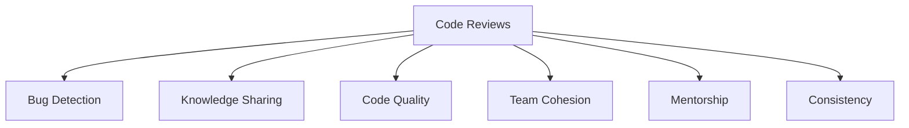
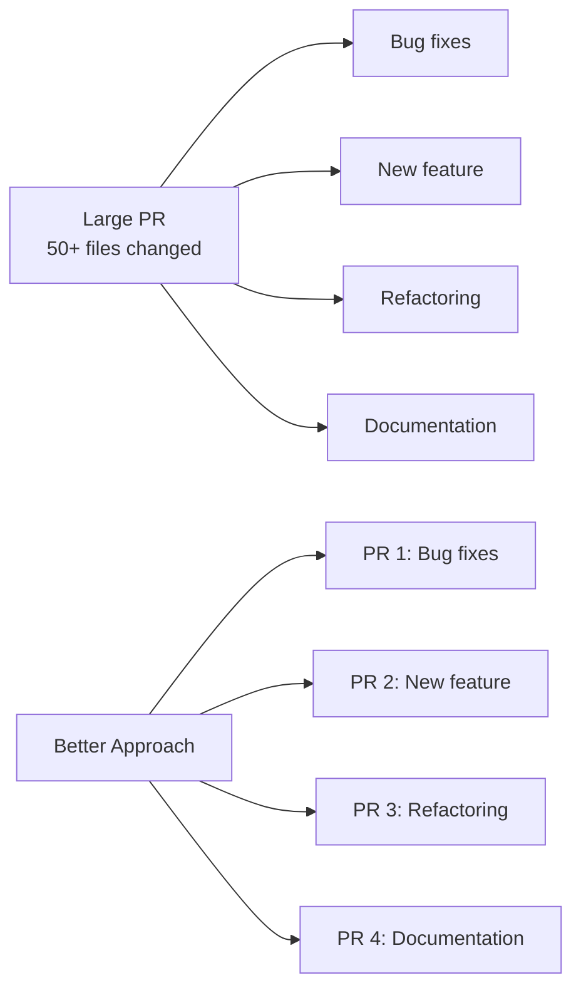
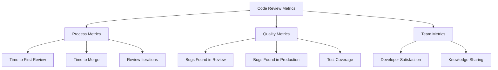

# Code Review Best Practices: Beyond Finding Bugs

## Introduction

Code reviews are one of the most valuable practices in software development, yet they're often reduced to just finding bugs. A well-executed code review process does much more—it improves code quality, spreads knowledge, ensures consistency, and helps teams grow together.

This article explores best practices for both code reviewers and authors to create a positive, effective code review culture that elevates the entire team.

## The Value of Code Reviews

Code reviews provide multiple benefits beyond catching bugs:



- **Knowledge Sharing**: Reduces knowledge silos and "bus factor"
- **Consistent Standards**: Ensures codebase follows agreed-upon patterns
- **Mentorship**: Provides learning opportunities for both junior and senior developers
- **Team Ownership**: Creates shared responsibility for code quality
- **Documentation**: Reviews often highlight areas needing better documentation

## For Code Authors: Preparing for Review

### Keep Changes Small and Focused

Small, focused changes are easier to review thoroughly and get merged quickly.



**Tip**: Aim for pull requests that can be reviewed in 30 minutes or less.

### Write Clear Descriptions

A good pull request description helps reviewers understand context and intent.

**Example of a poor description:**
```
Fixed the login bug and made some improvements.
```

**Example of a good description:**
```
## Problem
Users were unable to log in when using email addresses containing a plus sign (e.g., user+tag@example.com) due to improper validation in the login form.

## Solution
Updated the email validation regex to comply with RFC 5322, which allows for plus signs in email addresses. Added tests for various email formats to prevent regression.

## Testing
- Manually tested login with regular emails and emails containing plus signs
- Added unit tests for the email validator
- All existing tests pass

## Screenshots
[Before/After screenshots of the login form]
```

### Self-Review Before Requesting Reviews

Review your own code first to catch obvious issues:

- Run linters and formatters
- Ensure tests pass
- Check for debugging code or commented-out code
- Look for TODOs that should be addressed
- Verify documentation is updated

### Respond to Feedback Constructively

- Thank reviewers for their feedback
- Ask for clarification when needed
- Explain your reasoning when disagreeing
- Avoid being defensive

## For Reviewers: Providing Effective Feedback

### Focus on the Code, Not the Coder

Frame comments about the code, not the person who wrote it.

**Instead of:**
```
You didn't handle the error case here.
```

**Say:**
```
This code might need error handling for the case when the API returns a 404.
```

### Use a Consistent Review Pattern

Approach reviews systematically:

1. **Understand the goal**: What problem is this code solving?
2. **Check correctness**: Does the code work as intended?
3. **Consider edge cases**: What could go wrong?
4. **Review architecture**: Is the design appropriate?
5. **Check readability**: Is the code clear and maintainable?
6. **Verify tests**: Are there sufficient tests?

### Be Specific and Actionable

Vague feedback is difficult to address.

**Instead of:**
```
This function is too complex.
```

**Say:**
```
This function has 25 lines and handles multiple responsibilities (validation, processing, and notification). Consider breaking it into smaller, single-purpose functions to improve readability and testability.
```

### Ask Questions Instead of Making Demands

Questions encourage discussion and learning.

**Instead of:**
```
Use a dictionary here instead of a list.
```

**Say:**
```
Have you considered using a dictionary here instead of a list? It might provide O(1) lookups instead of O(n), which could be beneficial for larger datasets.
```

### Provide Both Positive and Constructive Feedback

Acknowledge good work alongside suggestions for improvement.

```
I like how you've structured the authentication flow with clear separation of concerns.

The error handling in the API client is thorough and well-documented.

One suggestion: consider extracting the validation logic into a separate function to make the main function more focused.
```

### Use Code Examples When Helpful

Concrete examples can clarify your suggestions.

```
Instead of nested if statements, you might consider early returns to reduce nesting:

// Instead of
if (isValid) {
  if (hasPermission) {
    // Do something
  }
}

// Consider
if (!isValid) return;
if (!hasPermission) return;
// Do something
```

## Establishing a Code Review Culture

### Define Clear Standards

Document your team's coding standards and review expectations.

**Example code review checklist:**

```markdown
## Functionality
- [ ] Code works as described in the requirements
- [ ] Edge cases are handled appropriately
- [ ] Error states are handled gracefully

## Code Quality
- [ ] Code follows team's style guide
- [ ] No unnecessary complexity
- [ ] No duplicated code
- [ ] Naming is clear and consistent

## Testing
- [ ] Tests cover the new functionality
- [ ] Tests cover edge cases
- [ ] All tests pass

## Security
- [ ] Input is validated
- [ ] Authentication/authorization checks are in place
- [ ] Sensitive data is handled appropriately

## Documentation
- [ ] Code is commented where necessary
- [ ] API documentation is updated
- [ ] README/wiki is updated if needed
```

### Set Reasonable Expectations

- Establish target response times for reviews
- Define what constitutes approval
- Clarify when it's appropriate to merge

### Automate What Can Be Automated

Use tools to handle mechanical aspects of code review:

- Linters and formatters (ESLint, Prettier, Black)
- Static analysis tools
- Automated tests
- CI/CD pipelines

```yaml
# Example GitHub Actions workflow for automated checks
name: Code Quality Checks

on: [pull_request]

jobs:
  lint:
    runs-on: ubuntu-latest
    steps:
      - uses: actions/checkout@v2
      - name: Set up Node.js
        uses: actions/setup-node@v1
        with:
          node-version: '14'
      - name: Install dependencies
        run: npm ci
      - name: Run ESLint
        run: npm run lint
      - name: Run Prettier
        run: npm run format:check
      
  test:
    runs-on: ubuntu-latest
    steps:
      - uses: actions/checkout@v2
      - name: Set up Node.js
        uses: actions/setup-node@v1
        with:
          node-version: '14'
      - name: Install dependencies
        run: npm ci
      - name: Run tests
        run: npm test
```

### Train the Team

Invest in training for both giving and receiving code reviews:

- Share articles and resources on effective code reviews
- Discuss code review experiences in retrospectives
- Pair junior and senior developers for review mentoring

## Handling Common Code Review Challenges

### When Reviews Take Too Long

- Break changes into smaller, more focused pull requests
- Set up "review swaps" where team members agree to review each other's code
- Establish dedicated review time in the team's schedule
- Use pair programming for complex changes to reduce review time later

### When Feedback Gets Heated

- Take a step back and remember the shared goal of code quality
- Move discussions to a synchronous medium if written communication isn't working
- Focus on the technical merits rather than personal preferences
- Involve a third party if necessary

### When Reviews Are Too Shallow

- Provide review templates or checklists
- Allocate dedicated time for thorough reviews
- Recognize and reward thorough reviews
- Lead by example with your own reviews

## Remote Code Reviews

Remote teams face additional challenges with code reviews:

- **Asynchronous Communication**: Be clear and thorough in written feedback
- **Lack of Context**: Provide more background in PR descriptions
- **Time Zone Differences**: Set expectations for response times
- **Cultural Differences**: Be aware of communication styles

Consider occasional video calls for complex reviews to improve communication.

## Measuring Code Review Effectiveness

Track metrics to improve your review process:

- Time from PR submission to first review
- Time to PR merge
- Number of bugs found in review vs. production
- Team satisfaction with the review process



## Conclusion

Effective code reviews are an investment that pays dividends in code quality, team growth, and project health. By establishing clear expectations, focusing on constructive feedback, and continuously improving your process, you can transform code reviews from a chore into a valuable collaborative practice.

Remember that the ultimate goal of code reviews is not just better code, but better developers and better teams.

## References

1. Fitzpatrick, B., & Collins-Sussman, B. (2018). Debugging Teams: Better Productivity through Collaboration. O'Reilly Media.
2. Cohen, J. (2010). Modern Code Review. In A. Oram & G. Wilson (Eds.), Making Software: What Really Works, and Why We Believe It. O'Reilly Media.
3. Google Engineering Practices Documentation. (2021). How to do a code review. https://google.github.io/eng-practices/review/reviewer/
