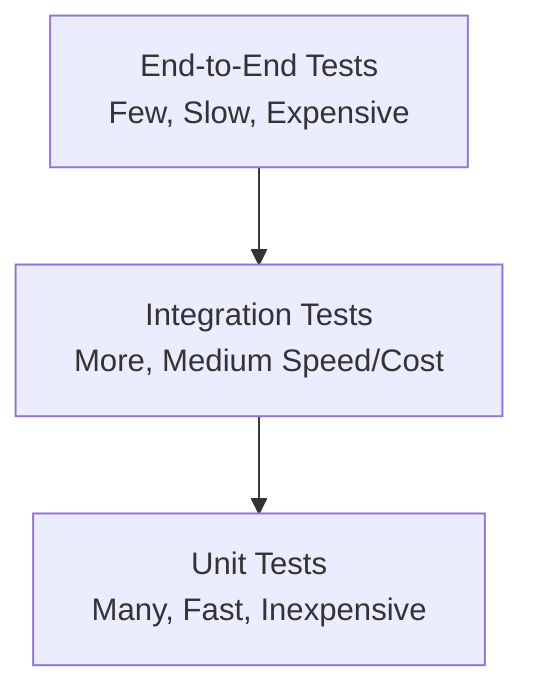
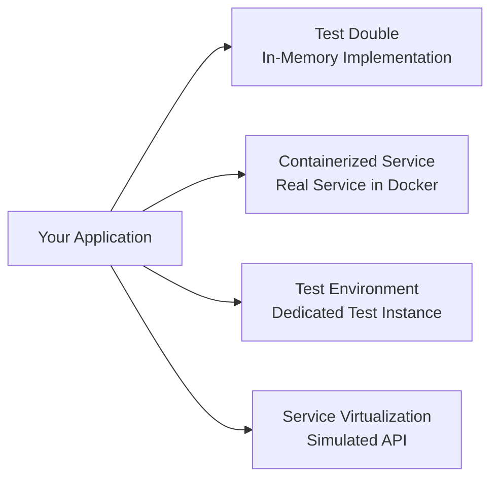
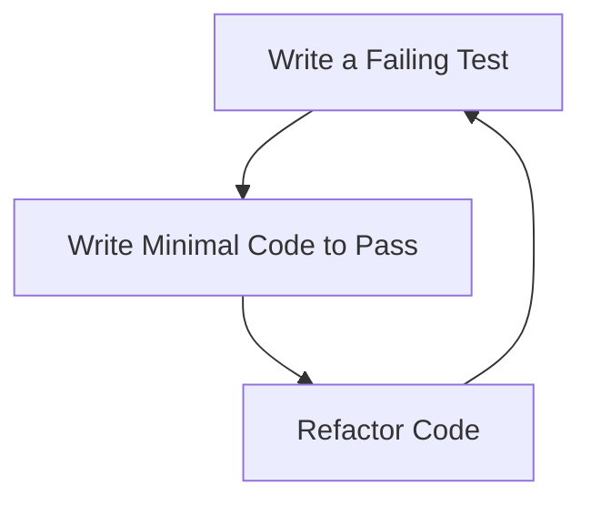

# Testing Strategies: Building Confidence in Your Code

## Introduction

Effective testing is a cornerstone of software quality. It provides confidence that your code works as expected, catches regressions before they reach production, and serves as living documentation of your system's behavior. However, with numerous testing approaches available, it can be challenging to determine the right strategy for your project.

This article explores different testing strategies and how to implement them effectively in your development workflow.

## The Testing Pyramid

The testing pyramid is a visual representation of how different types of tests should be distributed in a healthy test suite:



This model suggests that you should have:
- Many unit tests that run quickly and test small pieces of code in isolation
- Fewer integration tests that verify how components work together
- A small number of end-to-end tests that validate the entire system

Let's explore each level in detail.

## Unit Testing

Unit tests verify that individual components (functions, methods, classes) work correctly in isolation.

### Characteristics of Good Unit Tests

- **Fast**: Unit tests should execute in milliseconds
- **Isolated**: No dependencies on external systems or other units
- **Repeatable**: Produces the same results each time
- **Self-validating**: Automatically determines if the test passed or failed
- **Timely**: Written close to the production code they test

### Example: Unit Testing a Function

```javascript
// Function to test
function calculateDiscount(price, discountPercentage) {
  if (typeof price !== 'number' || typeof discountPercentage !== 'number') {
    throw new Error('Price and discount must be numbers');
  }
  
  if (price < 0 || discountPercentage < 0 || discountPercentage > 100) {
    throw new Error('Invalid price or discount values');
  }
  
  return price * (discountPercentage / 100);
}

// Jest unit tests
describe('calculateDiscount', () => {
  test('calculates discount correctly', () => {
    expect(calculateDiscount(100, 20)).toBe(20);
    expect(calculateDiscount(50, 10)).toBe(5);
  });
  
  test('handles zero values', () => {
    expect(calculateDiscount(0, 20)).toBe(0);
    expect(calculateDiscount(100, 0)).toBe(0);
  });
  
  test('throws error for non-numeric inputs', () => {
    expect(() => calculateDiscount('100', 20)).toThrow();
    expect(() => calculateDiscount(100, '20')).toThrow();
  });
  
  test('throws error for invalid values', () => {
    expect(() => calculateDiscount(-100, 20)).toThrow();
    expect(() => calculateDiscount(100, -20)).toThrow();
    expect(() => calculateDiscount(100, 120)).toThrow();
  });
});
```

### Mocking Dependencies

When a unit has dependencies, use mocks to isolate it for testing:

```typescript
// Class to test
class UserService {
  constructor(private userRepository: UserRepository) {}
  
  async getUserDetails(userId: string): Promise<UserDetails | null> {
    const user = await this.userRepository.findById(userId);
    if (!user) return null;
    
    return {
      id: user.id,
      name: user.name,
      email: user.email,
      isActive: user.status === 'ACTIVE'
    };
  }
}

// Jest test with mocking
describe('UserService', () => {
  let userService: UserService;
  let mockUserRepository: jest.Mocked<UserRepository>;
  
  beforeEach(() => {
    mockUserRepository = {
      findById: jest.fn()
    } as any;
    
    userService = new UserService(mockUserRepository);
  });
  
  test('returns null when user not found', async () => {
    mockUserRepository.findById.mockResolvedValue(null);
    
    const result = await userService.getUserDetails('non-existent-id');
    
    expect(result).toBeNull();
    expect(mockUserRepository.findById).toHaveBeenCalledWith('non-existent-id');
  });
  
  test('transforms user data correctly', async () => {
    mockUserRepository.findById.mockResolvedValue({
      id: 'user-1',
      name: 'John Doe',
      email: 'john@example.com',
      status: 'ACTIVE'
    });
    
    const result = await userService.getUserDetails('user-1');
    
    expect(result).toEqual({
      id: 'user-1',
      name: 'John Doe',
      email: 'john@example.com',
      isActive: true
    });
  });
});
```

## Integration Testing

Integration tests verify that different components work together correctly.

### Types of Integration Tests

- **Component Integration**: Testing interactions between closely related components
- **Service Integration**: Testing interactions with external services
- **API Integration**: Testing API endpoints end-to-end

### Example: API Integration Test

```javascript
// Express API endpoint
app.post('/api/orders', async (req, res) => {
  try {
    const { userId, products } = req.body;
    
    // Validate input
    if (!userId || !products || !Array.isArray(products) || products.length === 0) {
      return res.status(400).json({ error: 'Invalid order data' });
    }
    
    // Create order
    const order = await orderService.createOrder(userId, products);
    
    return res.status(201).json({ orderId: order.id });
  } catch (error) {
    console.error('Order creation failed:', error);
    return res.status(500).json({ error: 'Failed to create order' });
  }
});

// Supertest integration test
describe('POST /api/orders', () => {
  beforeEach(async () => {
    // Set up test database
    await setupTestDatabase();
  });
  
  afterEach(async () => {
    // Clean up test database
    await cleanupTestDatabase();
  });
  
  test('creates a new order successfully', async () => {
    // Create a test user first
    const user = await createTestUser();
    
    const response = await request(app)
      .post('/api/orders')
      .send({
        userId: user.id,
        products: [
          { id: 'product-1', quantity: 2 },
          { id: 'product-2', quantity: 1 }
        ]
      });
    
    expect(response.status).toBe(201);
    expect(response.body).toHaveProperty('orderId');
    
    // Verify order was created in database
    const order = await getOrderFromDb(response.body.orderId);
    expect(order).toBeDefined();
    expect(order.userId).toBe(user.id);
    expect(order.products).toHaveLength(2);
  });
  
  test('returns 400 for invalid input', async () => {
    const response = await request(app)
      .post('/api/orders')
      .send({
        userId: 'user-1',
        // Missing products array
      });
    
    expect(response.status).toBe(400);
  });
});
```

### Testing with External Dependencies

For integration tests involving external services, you have several options:

1. **Test doubles**: Use in-memory implementations of external services
2. **Containerized dependencies**: Use Docker to spin up real services locally
3. **Test environments**: Use dedicated test instances of external services
4. **Service virtualization**: Use tools like WireMock to simulate external APIs



## End-to-End Testing

End-to-end (E2E) tests verify that the entire application works correctly from the user's perspective.

### Characteristics of E2E Tests

- Test the application as a user would interact with it
- Cover critical user journeys
- Involve all parts of the system, including UI, backend, and databases
- Typically slower and more brittle than other tests

### Example: E2E Test with Cypress

```javascript
// Cypress E2E test for a checkout flow
describe('Checkout Flow', () => {
  beforeEach(() => {
    // Set up test data and login
    cy.task('seedTestData');
    cy.login('testuser@example.com', 'password123');
  });
  
  it('allows a user to complete a purchase', () => {
    // Visit product page
    cy.visit('/products/test-product');
    
    // Add to cart
    cy.get('[data-testid="add-to-cart-button"]').click();
    cy.get('[data-testid="cart-count"]').should('contain', '1');
    
    // Go to cart
    cy.get('[data-testid="cart-icon"]').click();
    cy.url().should('include', '/cart');
    cy.get('[data-testid="cart-items"]').should('contain', 'Test Product');
    
    // Proceed to checkout
    cy.get('[data-testid="checkout-button"]').click();
    cy.url().should('include', '/checkout');
    
    // Fill shipping information
    cy.get('[data-testid="shipping-form"]').within(() => {
      cy.get('[name="address"]').type('123 Test St');
      cy.get('[name="city"]').type('Test City');
      cy.get('[name="zip"]').type('12345');
      cy.get('[data-testid="continue-button"]').click();
    });
    
    // Select payment method
    cy.get('[data-testid="payment-method-credit-card"]').click();
    cy.get('[data-testid="continue-button"]').click();
    
    // Review order and submit
    cy.get('[data-testid="order-summary"]').should('contain', 'Test Product');
    cy.get('[data-testid="place-order-button"]').click();
    
    // Verify order confirmation
    cy.url().should('include', '/order-confirmation');
    cy.get('[data-testid="order-confirmation-message"]').should('be.visible');
    cy.get('[data-testid="order-number"]').should('exist');
  });
});
```

## Test-Driven Development (TDD)

Test-Driven Development is a development process where you write tests before writing the implementation code.

### The TDD Cycle



1. **Red**: Write a failing test that defines the desired behavior
2. **Green**: Write the minimal amount of code to make the test pass
3. **Refactor**: Improve the code while keeping the tests passing

### Example: TDD for a Password Validator

```javascript
// Step 1: Write a failing test
test('password must be at least 8 characters', () => {
  const validator = new PasswordValidator();
  expect(validator.validate('short')).toBe(false);
  expect(validator.validate('longenough')).toBe(true);
});

// Step 2: Write minimal code to pass
class PasswordValidator {
  validate(password) {
    return password.length >= 8;
  }
}

// Step 3: Write the next failing test
test('password must contain at least one number', () => {
  const validator = new PasswordValidator();
  expect(validator.validate('onlyletters')).toBe(false);
  expect(validator.validate('letters1number')).toBe(true);
});

// Step 4: Update code to pass both tests
class PasswordValidator {
  validate(password) {
    return password.length >= 8 && /\d/.test(password);
  }
}

// Continue with more tests and implementation
```

## Property-Based Testing

Property-based testing generates random inputs to test properties that should hold true for all inputs.

### Example: Property-Based Testing with Jest-Fast-Check

```javascript
import fc from 'fast-check';

// Function to test
function sortNumbers(numbers) {
  return [...numbers].sort((a, b) => a - b);
}

// Property-based test
test('sorted array should contain the same elements as the input', () => {
  fc.assert(
    fc.property(
      fc.array(fc.integer()),
      (numbers) => {
        const sorted = sortNumbers(numbers);
        return (
          sorted.length === numbers.length &&
          [...numbers].every(n => sorted.includes(n))
        );
      }
    )
  );
});

test('sorted array should be in ascending order', () => {
  fc.assert(
    fc.property(
      fc.array(fc.integer()),
      (numbers) => {
        const sorted = sortNumbers(numbers);
        for (let i = 1; i < sorted.length; i++) {
          if (sorted[i] < sorted[i - 1]) return false;
        }
        return true;
      }
    )
  );
});
```

## Mutation Testing

Mutation testing evaluates the quality of your tests by introducing bugs (mutations) in your code and checking if your tests catch them.

### Example: Mutation Testing with Stryker

```bash
# Install Stryker
npm install --save-dev @stryker-mutator/core @stryker-mutator/jest-runner

# Create stryker.conf.js
module.exports = {
  packageManager: "npm",
  reporters: ["html", "clear-text", "progress"],
  testRunner: "jest",
  coverageAnalysis: "perTest",
  jest: {
    projectType: "create-react-app"
  },
  mutate: ["src/**/*.js", "!src/**/*.test.js"]
};

# Run mutation testing
npx stryker run
```

Sample output:
```
Mutation testing report:
All files: 85.71% (6/7)
src/calculator.js: 85.71% (6/7)
Killed: 6
Survived: 1
Mutants: 7

Survived mutants:
src/calculator.js:10:13
- if (a < 0 || b < 0) {
+ if (false) {
```

This indicates that your tests didn't catch a mutation where the negative number check was removed.

## Testing in CI/CD Pipelines

Integrating tests into your CI/CD pipeline ensures code quality before deployment.

### Example: GitHub Actions Workflow

```yaml
name: Test and Deploy

on:
  push:
    branches: [ main ]
  pull_request:
    branches: [ main ]

jobs:
  test:
    runs-on: ubuntu-latest
    
    steps:
    - uses: actions/checkout@v2
    
    - name: Set up Node.js
      uses: actions/setup-node@v2
      with:
        node-version: '14'
        
    - name: Install dependencies
      run: npm ci
      
    - name: Lint
      run: npm run lint
      
    - name: Unit tests
      run: npm run test:unit
      
    - name: Integration tests
      run: npm run test:integration
      
    - name: Upload coverage
      uses: codecov/codecov-action@v2
      
  e2e-tests:
    needs: test
    runs-on: ubuntu-latest
    
    steps:
    - uses: actions/checkout@v2
    
    - name: Set up Node.js
      uses: actions/setup-node@v2
      with:
        node-version: '14'
        
    - name: Install dependencies
      run: npm ci
      
    - name: Build
      run: npm run build
      
    - name: Start application
      run: npm run start:ci &
      
    - name: Run E2E tests
      run: npm run test:e2e
      
  deploy:
    needs: [test, e2e-tests]
    if: github.event_name == 'push' && github.ref == 'refs/heads/main'
    runs-on: ubuntu-latest
    
    steps:
    - uses: actions/checkout@v2
    
    # Deployment steps here
```

## Test Coverage

Test coverage measures how much of your code is executed during tests.

### Types of Coverage Metrics

- **Line coverage**: Percentage of lines executed
- **Branch coverage**: Percentage of branches (if/else, switch cases) executed
- **Function coverage**: Percentage of functions called
- **Statement coverage**: Percentage of statements executed

### Example: Coverage Report with Jest

```bash
# Run tests with coverage
jest --coverage
```

Output:
```
--------------------|---------|----------|---------|---------|-------------------
File                | % Stmts | % Branch | % Funcs | % Lines | Uncovered Line #s 
--------------------|---------|----------|---------|---------|-------------------
All files           |   92.31 |    83.33 |     100 |   92.31 |                   
 calculator.js      |     100 |      100 |     100 |     100 |                   
 stringUtils.js     |   85.71 |       75 |     100 |   85.71 | 15                
--------------------|---------|----------|---------|---------|-------------------
```

## Choosing the Right Testing Strategy

The optimal testing strategy depends on your project's specific needs:

### Factors to Consider

- **Project size and complexity**: Larger projects need more comprehensive testing
- **Team size and experience**: More experienced teams may adopt more advanced techniques
- **Domain criticality**: Critical systems require more thorough testing
- **Development methodology**: Agile projects may emphasize different testing approaches
- **Release frequency**: Frequent releases benefit from automated testing

### Common Testing Strategies

1. **TDD-First**: Emphasize test-driven development for all new code
2. **Integration-Heavy**: Focus on integration tests for systems with many external dependencies
3. **E2E-Focused**: Prioritize end-to-end tests for user-facing applications
4. **Balanced Pyramid**: Maintain a balanced mix of unit, integration, and E2E tests
5. **Risk-Based**: Focus testing efforts on high-risk or complex areas

## Conclusion

Effective testing is not just about having tests—it's about having the right tests that give you confidence in your code. By understanding different testing approaches and how they complement each other, you can develop a testing strategy that fits your project's needs.

Remember that testing is an investment in code quality and maintainability. The time spent writing good tests pays dividends in reduced bugs, easier refactoring, and more confident deployments.

## References

1. Fowler, M. (2012). Test Pyramid. https://martinfowler.com/bliki/TestPyramid.html
2. Cohn, M. (2009). Succeeding with Agile: Software Development Using Scrum. Addison-Wesley.
3. Beck, K. (2002). Test-Driven Development: By Example. Addison-Wesley.
4. Osherove, R. (2013). The Art of Unit Testing (2nd ed.). Manning Publications.
