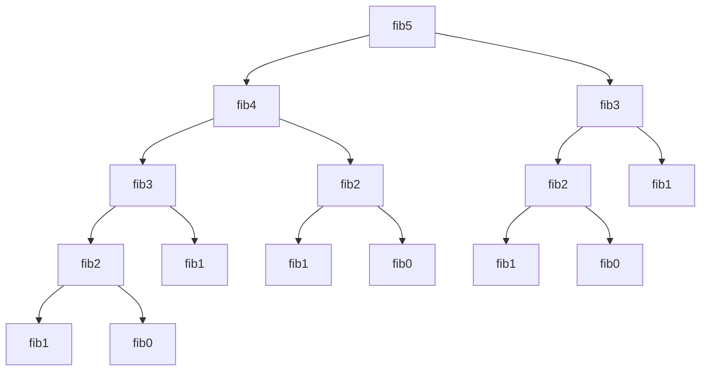
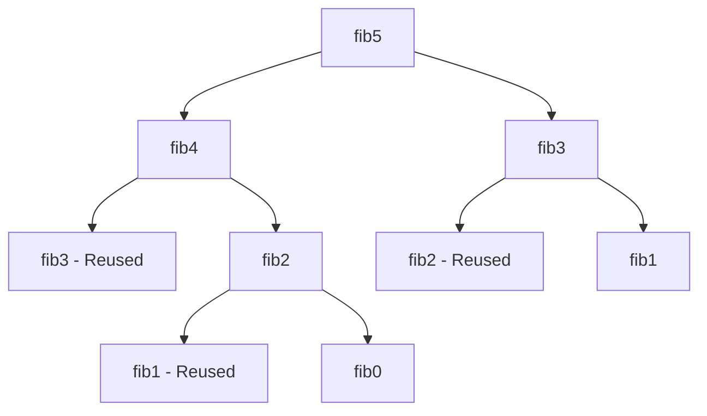

# Dynamic Programming Fundamentals: From Recursion to Optimization

## Introduction

Dynamic Programming (DP) is a powerful algorithmic technique for solving complex problems by breaking them down into simpler subproblems. It's particularly effective for optimization problems where the goal is to find the best solution among many possible options.

Despite its power, dynamic programming can be challenging to master. This article aims to demystify DP by explaining its core principles, common patterns, and practical applications.

## Understanding Dynamic Programming

Dynamic programming is based on two key insights:

1. **Optimal Substructure**: An optimal solution to a problem contains optimal solutions to its subproblems.
2. **Overlapping Subproblems**: The same subproblems are solved multiple times when using a naive recursive approach.

DP addresses these insights by:
- Breaking down a problem into simpler subproblems
- Solving each subproblem only once
- Storing the results of subproblems (memoization)
- Reusing these results to build solutions to larger problems

## From Recursion to Dynamic Programming

Let's illustrate the transition from recursion to dynamic programming with the classic Fibonacci sequence problem.

### Recursive Approach

```python
def fibonacci(n):
    if n <= 1:
        return n
    return fibonacci(n-1) + fibonacci(n-2)
```

This recursive solution has a time complexity of O(2^n) because it recalculates the same values repeatedly:



Notice how 'fib3', 'fib2', 'fib1', and 'fib0' are calculated multiple times.

### Top-Down DP (Memoization)

Memoization optimizes the recursive approach by storing previously calculated results:

```python
def fibonacci_memo(n, memo={}):
    if n in memo:
        return memo[n]
    if n <= 1:
        return n
    memo[n] = fibonacci_memo(n-1, memo) + fibonacci_memo(n-2, memo)
    return memo[n]
```

With memoization, each Fibonacci number is calculated only once, reducing time complexity to O(n):



### Bottom-Up DP (Tabulation)

Tabulation builds solutions from the bottom up, starting with the smallest subproblems:

```python
def fibonacci_tab(n):
    if n <= 1:
        return n
    
    dp = [0] * (n + 1)
    dp[1] = 1
    
    for i in range(2, n + 1):
        dp[i] = dp[i-1] + dp[i-2]
    
    return dp[n]
```

This approach also has O(n) time complexity but uses iteration instead of recursion, avoiding potential stack overflow issues with large inputs.

## Common Dynamic Programming Patterns

### 1. Linear Sequence DP

Problems where the state depends on previous states in a linear sequence.

**Example: Maximum Subarray Sum**

Find the contiguous subarray with the largest sum.

```python
def max_subarray_sum(nums):
    if not nums:
        return 0
    
    # dp[i] represents the maximum sum ending at index i
    dp = [0] * len(nums)
    dp[0] = nums[0]
    
    for i in range(1, len(nums)):
        # Either extend the previous subarray or start a new one
        dp[i] = max(nums[i], dp[i-1] + nums[i])
    
    return max(dp)
```

### 2. Two-Dimensional DP

Problems where the state depends on results from a 2D grid of subproblems.

**Example: Longest Common Subsequence**

Find the length of the longest subsequence present in two strings.

```python
def longest_common_subsequence(text1, text2):
    m, n = len(text1), len(text2)
    
    # dp[i][j] represents the length of LCS for text1[0...i-1] and text2[0...j-1]
    dp = [[0] * (n + 1) for _ in range(m + 1)]
    
    for i in range(1, m + 1):
        for j in range(1, n + 1):
            if text1[i-1] == text2[j-1]:
                dp[i][j] = dp[i-1][j-1] + 1
            else:
                dp[i][j] = max(dp[i-1][j], dp[i][j-1])
    
    return dp[m][n]
```

Visualization of the DP table for "ABCDE" and "ACE":

```
|    | '' | A | C | E |
-----------------------
| '' | 0  | 0 | 0 | 0 |
-----------------------
| A  | 0  | 1 | 1 | 1 |
-----------------------
| B  | 0  | 1 | 1 | 1 |
-----------------------
| C  | 0  | 1 | 2 | 2 |
-----------------------
| D  | 0  | 1 | 2 | 2 |
-----------------------
| E  | 0  | 1 | 2 | 3 |
-----------------------
```

### 3. State Transition DP

Problems where you need to track different states and transitions between them.

**Example: House Robber**

Determine the maximum amount of money you can rob without robbing adjacent houses.

```python
def rob(nums):
    if not nums:
        return 0
    
    n = len(nums)
    
    # Edge cases
    if n == 1:
        return nums[0]
    
    # dp[i] represents the maximum amount that can be robbed up to house i
    dp = [0] * n
    dp[0] = nums[0]
    dp[1] = max(nums[0], nums[1])
    
    for i in range(2, n):
        # Either rob the current house and the house before the previous one,
        # or skip the current house
        dp[i] = max(dp[i-1], dp[i-2] + nums[i])
    
    return dp[n-1]
```

### 4. Interval DP

Problems involving intervals or subarrays where you build solutions by combining results from smaller intervals.

**Example: Matrix Chain Multiplication**

Find the most efficient way to multiply a chain of matrices.

```python
def matrix_chain_multiplication(dimensions):
    n = len(dimensions) - 1  # Number of matrices
    
    # dp[i][j] represents the minimum number of operations to multiply
    # matrices from i to j
    dp = [[0] * n for _ in range(n)]
    
    # Length of chain
    for l in range(1, n):
        # Starting position
        for i in range(n - l):
            j = i + l
            dp[i][j] = float('inf')
            
            # Try different splitting points
            for k in range(i, j):
                operations = (dp[i][k] + dp[k+1][j] + 
                             dimensions[i] * dimensions[k+1] * dimensions[j+1])
                dp[i][j] = min(dp[i][j], operations)
    
    return dp[0][n-1]
```

### 5. Knapsack-Type DP

Problems involving selection from a set of items with constraints.

**Example: 0/1 Knapsack**

Select items to maximize value while keeping total weight under a limit.

```python
def knapsack(weights, values, capacity):
    n = len(weights)
    
    # dp[i][w] represents the maximum value that can be obtained
    # using the first i items and with a knapsack of capacity w
    dp = [[0] * (capacity + 1) for _ in range(n + 1)]
    
    for i in range(1, n + 1):
        for w in range(capacity + 1):
            # If the current item is too heavy, skip it
            if weights[i-1] > w:
                dp[i][w] = dp[i-1][w]
            else:
                # Either include the current item or exclude it
                dp[i][w] = max(dp[i-1][w], dp[i-1][w-weights[i-1]] + values[i-1])
    
    return dp[n][capacity]
```

## Space Optimization in DP

Many DP solutions can be optimized to use less space. For example, the Fibonacci solution can be optimized to use only O(1) space:

```python
def fibonacci_optimized(n):
    if n <= 1:
        return n
    
    a, b = 0, 1
    for _ in range(2, n + 1):
        a, b = b, a + b
    
    return b
```

Similarly, the knapsack problem can be optimized to use O(capacity) space instead of O(n * capacity):

```python
def knapsack_optimized(weights, values, capacity):
    n = len(weights)
    dp = [0] * (capacity + 1)
    
    for i in range(n):
        # We need to iterate backwards to avoid using the updated values
        for w in range(capacity, weights[i] - 1, -1):
            dp[w] = max(dp[w], dp[w - weights[i]] + values[i])
    
    return dp[capacity]
```

## Real-World Applications of Dynamic Programming

Dynamic programming is used in many practical applications:

1. **Shortest Path Algorithms**: Dijkstra's and Floyd-Warshall algorithms use DP principles
2. **Natural Language Processing**: Sequence alignment, speech recognition
3. **Bioinformatics**: DNA sequence alignment, protein folding
4. **Finance**: Portfolio optimization, option pricing
5. **Resource Allocation**: Task scheduling, resource distribution

## Advanced DP: Bitmasking

Bitmasking is a technique used in DP to efficiently represent and manipulate sets.

**Example: Traveling Salesman Problem**

Find the shortest possible route that visits each city exactly once and returns to the origin city.

```python
def traveling_salesman(distances):
    n = len(distances)
    # dp[mask][i] represents the shortest path that visits all cities in the
    # mask and ends at city i
    dp = [[float('inf')] * n for _ in range(1 << n)]
    
    # Base case: start at city 0
    dp[1][0] = 0
    
    # Iterate through all possible subsets of cities
    for mask in range(1, 1 << n):
        for end in range(n):
            # If the end city is not in the current subset, skip
            if not (mask & (1 << end)):
                continue
            
            # Previous subset without the end city
            prev_mask = mask ^ (1 << end)
            
            # If the previous subset is empty and end is not the starting city, skip
            if prev_mask == 0 and end != 0:
                continue
            
            # Try all possible previous cities
            for prev in range(n):
                if prev_mask & (1 << prev):
                    dp[mask][end] = min(dp[mask][end], 
                                       dp[prev_mask][prev] + distances[prev][end])
    
    # Return to the starting city
    return min(dp[(1 << n) - 1][i] + distances[i][0] for i in range(1, n))
```

## Common Challenges in Dynamic Programming

### 1. Identifying the Problem Type

Recognizing that a problem can be solved with DP is often the first challenge. Look for:
- Optimization problems (maximize/minimize)
- Counting problems (how many ways)
- Problems with overlapping subproblems
- Problems with optimal substructure

### 2. Defining the State

The state should capture all information needed to make decisions at each step. Ask:
- What information do I need to solve the current subproblem?
- What decisions can I make at this point?

### 3. Formulating the Recurrence Relation

The recurrence relation defines how to build solutions from smaller subproblems:
- What are the base cases?
- How do I transition from one state to another?
- How do I combine solutions to subproblems?

### 4. Implementation Choices

Decide between:
- Top-down (memoization) vs. bottom-up (tabulation)
- Space optimization techniques
- Data structures for state representation

## Conclusion

Dynamic programming is a powerful technique that can transform exponential-time algorithms into polynomial-time solutions. While it may seem complex at first, understanding the core principles and recognizing common patterns can help you apply DP effectively to a wide range of problems.

Practice is key to mastering dynamic programming. Start with simpler problems and gradually work your way up to more complex ones, paying attention to how the state is defined and how solutions to subproblems are combined.

## References

1. Cormen, T. H., Leiserson, C. E., Rivest, R. L., & Stein, C. (2009). Introduction to Algorithms (3rd ed.). MIT Press.
2. Bellman, R. (1957). Dynamic Programming. Princeton University Press.
3. Skiena, S. S. (2008). The Algorithm Design Manual (2nd ed.). Springer.
4. Sedgewick, R., & Wayne, K. (2011). Algorithms (4th ed.). Addison-Wesley.
