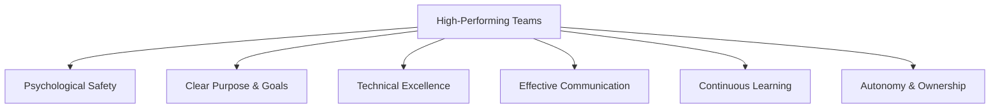
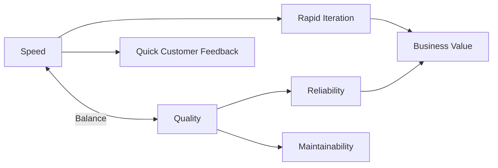
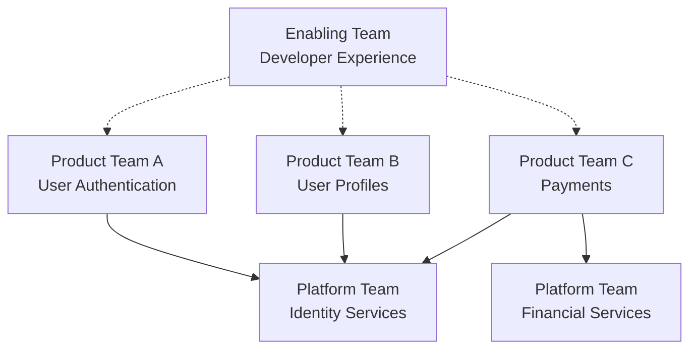

# Building High-Performing Engineering Teams: A Leader's Guide

## Introduction

Building and leading high-performing engineering teams is both an art and a science. In today's competitive tech landscape, the difference between good and great teams often determines an organization's ability to innovate, execute, and deliver value to customers.

This article explores evidence-based strategies for engineering leaders to build, nurture, and sustain high-performing teams that consistently deliver exceptional results.

## The Foundations of High-Performing Teams

High-performing engineering teams share several key characteristics:



### Psychological Safety

Psychological safety—the belief that one can speak up without fear of punishment or humiliation—is the most critical factor for team effectiveness, according to Google's Project Aristotle research.

**How to foster psychological safety:**

1. **Model vulnerability**: Share your own mistakes and learnings
2. **Encourage questions and challenges**: Reward intellectual curiosity and constructive dissent
3. **Separate the person from the problem**: Focus on ideas, not individuals
4. **Respond positively to failures**: Treat them as learning opportunities

**Example: Blameless Postmortems**

```markdown
# Incident Postmortem: API Outage on July 15

## Timeline
- 14:32: First customer reports of API errors
- 14:45: Alert triggered for high error rates
- 15:10: Root cause identified
- 15:25: Fix deployed
- 15:30: Service fully restored

## Root Cause
Database connection pool exhaustion due to a query leak in the new search feature

## What Went Well
- On-call engineer responded quickly
- Monitoring detected the issue within minutes
- Rollback process worked as designed

## What We Learned
- Our connection pool monitoring had a blind spot
- The code review process missed the query leak
- Our documentation for connection handling needs improvement

## Action Items
- Add connection pool saturation alerts
- Enhance code review checklist for database operations
- Schedule knowledge-sharing session on connection pooling best practices
```

### Clear Purpose and Goals

Teams perform best when they understand the "why" behind their work and have clear, measurable goals.

**Effective goal-setting framework:**

1. **Connect to mission**: Link team goals to broader organizational purpose
2. **Set OKRs (Objectives and Key Results)**: Define ambitious but achievable objectives with measurable results
3. **Balance metrics**: Include both output (e.g., features shipped) and outcome metrics (e.g., user engagement)
4. **Review regularly**: Revisit goals in weekly/monthly meetings to maintain focus

**Example OKRs for an Engineering Team:**

```
Objective: Improve application performance and reliability

Key Results:
1. Reduce p95 API response time from 500ms to 200ms
2. Decrease error rate from 0.5% to 0.1%
3. Improve test coverage from 75% to 90%
4. Reduce deployment failures from 5% to 1%
```

## Building Technical Excellence

### Hiring for Growth Mindset and Cultural Contribution

Hire for potential and values alignment, not just current skills.

**Effective hiring practices:**

1. **Define success criteria**: What does "good" look like for this role?
2. **Structured interviews**: Use consistent questions and evaluation criteria
3. **Diverse interview panels**: Include team members with different perspectives
4. **Technical and behavioral assessment**: Evaluate both technical skills and collaboration abilities
5. **Onboarding plan**: Prepare for success before the new hire starts

**Example Interview Scorecard:**

```
Candidate: [Name]
Position: Senior Software Engineer

Technical Skills (1-5):
- System Design: 4
- Coding Proficiency: 5
- Testing Approach: 3
- Architecture Knowledge: 4

Behavioral Skills (1-5):
- Communication: 5
- Problem-solving: 4
- Collaboration: 5
- Growth Mindset: 5

Cultural Values (1-5):
- Customer Focus: 4
- Innovation: 5
- Ownership: 4
- Inclusion: 5

Overall Assessment: Strong Hire (4.4/5)
```

### Creating a Culture of Technical Excellence

Technical excellence requires intentional culture-building:

1. **Define engineering principles**: Document and socialize your team's technical values
2. **Invest in tooling and automation**: Reduce toil and increase consistency
3. **Encourage refactoring**: Allocate time for technical debt reduction
4. **Promote knowledge sharing**: Create forums for learning and discussion

**Example Engineering Principles:**

```markdown
# Our Engineering Principles

## 1. Optimize for Change
We design systems that can evolve over time, recognizing that requirements will change.

## 2. Simplicity Over Complexity
We value simple solutions that are easy to understand, maintain, and debug.

## 3. Data-Driven Decisions
We measure what matters and use data to guide our technical choices.

## 4. Automate Everything Possible
We invest in automation to improve reliability and free up time for creative work.

## 5. Security and Privacy by Design
We consider security and privacy implications from the beginning of every project.
```

## Effective Team Processes

### Agile Done Right

Agile methodologies should be adapted to your team's specific needs:

1. **Focus on principles over practices**: Understand the "why" behind agile methods
2. **Iterate on your process**: Regularly review and improve how you work
3. **Minimize ceremonies**: Keep meetings focused and efficient
4. **Empower the team**: Let them shape how they work

**Example: Sprint Retrospective Format**

```markdown
# Sprint 23 Retrospective

## What went well?
- Delivered all committed user stories
- Pair programming improved code quality
- New automated testing approach reduced QA time

## What could be improved?
- Too many interruptions from production issues
- Sprint planning took too long
- Some stories were larger than expected

## Experiments for next sprint:
1. Implement "no meeting Wednesdays" for focused work
2. Add story point confidence rating during planning
3. Rotate production support role to reduce interruptions
```

### Balancing Delivery and Quality

High-performing teams maintain a balance between speed and quality:

1. **Define quality standards**: Agree on what "good enough" means
2. **Automate quality checks**: Implement CI/CD with robust testing
3. **Make quality everyone's responsibility**: Not just QA's job
4. **Measure quality metrics**: Track bugs, technical debt, and customer satisfaction



## Leading Through Growth and Change

### Scaling Teams Successfully

As teams grow, leadership approaches must evolve:

1. **Team structure**: Consider Conway's Law—team structure influences system architecture
2. **Communication channels**: Implement effective documentation and knowledge sharing
3. **Decision-making frameworks**: Clarify who makes which decisions and how
4. **Career ladders**: Provide clear growth paths for individual contributors and managers

**Example Team Topologies:**



### Navigating Organizational Change

Leading through change requires intentional change management:

1. **Create a compelling vision**: Explain the "why" behind changes
2. **Involve the team**: Seek input on implementation details
3. **Communicate consistently**: Repeat key messages through multiple channels
4. **Acknowledge challenges**: Be honest about difficulties and trade-offs
5. **Celebrate progress**: Recognize milestones and successes

**Example Change Communication Plan:**

```markdown
# Cloud Migration Communication Plan

## Key Messages
- Moving to the cloud will improve scalability and reliability
- Migration will happen in phases over 6 months
- Each team will receive training and support
- Customer impact will be minimal due to parallel running

## Communication Channels
- Monthly all-hands updates
- Weekly team standups
- Dedicated Slack channel
- Migration dashboard
- 1:1 check-ins with team leads

## Timeline
- Month 1: Announcement and vision sharing
- Month 2: Training and planning workshops
- Month 3-5: Phased migration with regular updates
- Month 6: Completion celebration and retrospective
```

## Measuring Team Performance

### Meaningful Metrics

Focus on outcomes over outputs:

1. **Lead time**: Time from idea to production
2. **Deployment frequency**: How often you deploy to production
3. **Change failure rate**: Percentage of deployments causing incidents
4. **Mean time to recovery**: How quickly you recover from failures
5. **Team satisfaction**: Engagement and well-being of team members

**Example Engineering Dashboard:**

```
Q3 Engineering Metrics:

Lead Time: 5.2 days (↓12% from Q2)
Deployment Frequency: 8.3 per week (↑15% from Q2)
Change Failure Rate: 2.1% (↓8% from Q2)
Mean Time to Recovery: 45 minutes (↓25% from Q2)
Team Satisfaction: 4.2/5 (↑0.3 from Q2)
```

### Continuous Improvement

Foster a culture of ongoing improvement:

1. **Regular retrospectives**: Review what's working and what isn't
2. **Experimentation**: Try new approaches in controlled ways
3. **Learning from failures**: Conduct blameless postmortems
4. **Industry benchmarking**: Compare your practices to other organizations

## Developing Engineering Leaders

### Growing Technical Leadership

Develop leadership at all levels:

1. **Identify potential**: Look for those who help others succeed
2. **Provide opportunities**: Assign stretch projects and leadership roles
3. **Offer mentorship**: Connect emerging leaders with experienced mentors
4. **Invest in training**: Provide leadership development resources

**Example Leadership Development Plan:**

```markdown
# Leadership Development Plan: Sarah Chen

## Current Role: Senior Software Engineer

## Development Goals:
1. Lead the authentication system redesign project
2. Improve technical communication skills
3. Develop mentoring capabilities
4. Build broader system architecture knowledge

## Action Items:
- Assign as technical lead for Q3 authentication project
- Enroll in Advanced System Design workshop
- Pair with junior engineer for 3 hours weekly
- Present monthly at architecture review meetings
- Schedule bi-weekly 1:1s with CTO for mentorship

## Success Metrics:
- Successfully deliver authentication project on time
- Positive feedback from junior engineer mentee
- Confident presentations at architecture reviews
- Readiness for Staff Engineer promotion by Q4
```

### Balancing Technical and People Leadership

Engineering leaders must balance technical guidance with people management:

1. **Stay technically relevant**: Remain connected to the codebase and technical decisions
2. **Delegate effectively**: Trust your team with technical details
3. **Focus on leverage**: Identify high-impact areas for your technical input
4. **Build a leadership team**: Develop technical leaders who can extend your reach

## Conclusion

Building high-performing engineering teams requires intentional leadership across multiple dimensions—from creating psychological safety to establishing technical excellence, from implementing effective processes to navigating change and growth.

The most successful engineering leaders:
- Create environments where people feel safe to take risks
- Set clear, meaningful goals aligned with organizational purpose
- Foster technical excellence through principles and practices
- Implement efficient processes that balance delivery and quality
- Navigate growth and change with transparency and empathy
- Measure what matters and continuously improve
- Develop the next generation of technical leaders

By focusing on these areas, engineering leaders can build teams that not only deliver exceptional results but also provide fulfilling experiences for team members and sustainable value for their organizations.

## References

1. Forsgren, N., Humble, J., & Kim, G. (2018). Accelerate: The Science of Lean Software and DevOps. IT Revolution Press.
2. Edmondson, A. C. (2018). The Fearless Organization: Creating Psychological Safety in the Workplace for Learning, Innovation, and Growth. Wiley.
3. Larson, E., & Gray, C. (2017). Project Management: The Managerial Process. McGraw-Hill Education.
4. Duhigg, C. (2016). What Google Learned From Its Quest to Build the Perfect Team. The New York Times Magazine.
