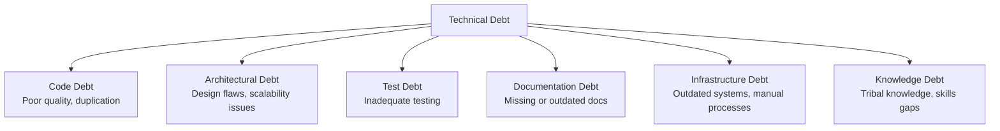
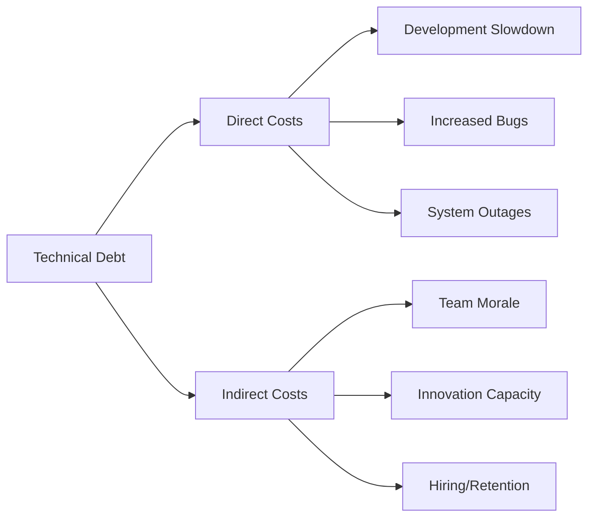
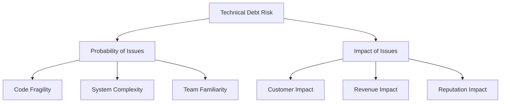
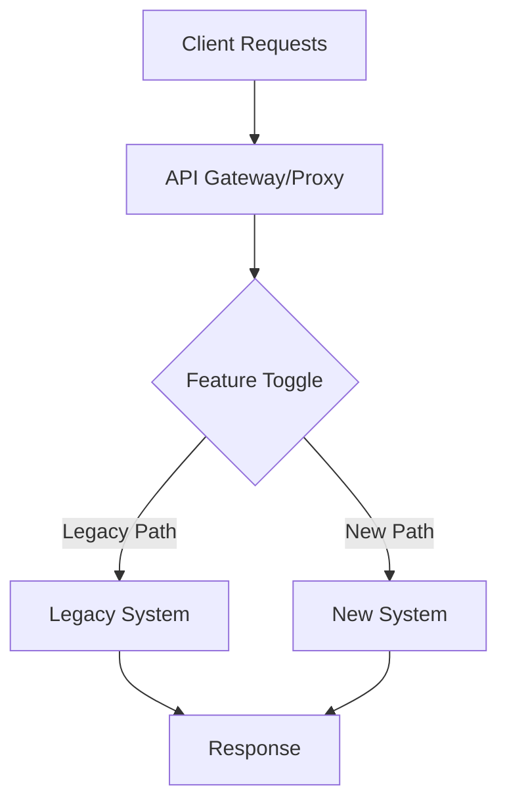
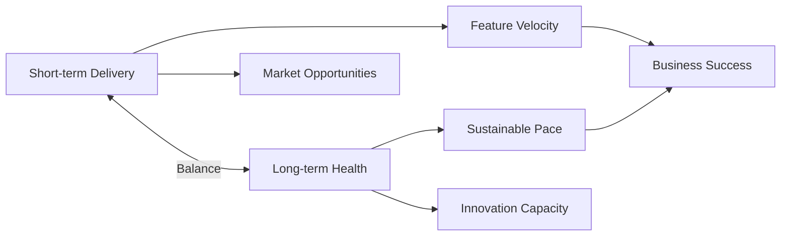

# Technical Debt Management: Strategies for Engineering Leaders

## Introduction

Technical debt is an inevitable part of software development. Like financial debt, it represents the implied cost of additional work caused by choosing an expedient solution now instead of a better approach that would take longer. While some technical debt is strategic, unmanaged debt can cripple development velocity, decrease reliability, and demoralize engineering teams.

This article explores how engineering leaders can effectively manage technical debt—identifying it, prioritizing it, and systematically addressing it while maintaining business momentum.

## Understanding Technical Debt

### Types of Technical Debt

Technical debt comes in various forms:



### Intentional vs. Unintentional Debt

Not all technical debt is created equal:

- **Intentional debt**: Deliberate trade-offs made with awareness of the consequences
  - *Example*: Launching with a simpler architecture to meet a market opportunity
  
- **Unintentional debt**: Issues that arise from mistakes, lack of knowledge, or changing requirements
  - *Example*: Poor code quality due to inexperience or time pressure

### The Cost of Technical Debt

Technical debt carries both direct and indirect costs:



**Example: Quantifying Technical Debt Impact**

```
Feature Development Time Comparison:

Feature A (Low-debt codebase): 
- Estimated: 10 days
- Actual: 12 days (20% overhead)

Similar Feature B (High-debt codebase):
- Estimated: 10 days
- Actual: 25 days (150% overhead)

Impact: 13 additional days of engineering time
Cost: ~$13,000 (at $1,000/day fully loaded cost)
```

## Identifying and Measuring Technical Debt

### Technical Debt Discovery

Proactively identify debt through:

1. **Regular code reviews**: Look for patterns of complexity and duplication
2. **Architecture reviews**: Assess alignment with current requirements and best practices
3. **Developer surveys**: Ask engineers where they face friction
4. **Performance metrics**: Monitor system performance and error rates
5. **"Pain point" workshops**: Gather team input on the most problematic areas

**Example: Developer Survey Questions**

```markdown
# Technical Debt Survey

Rate the following areas from 1 (minimal debt) to 5 (severe debt):

1. Code quality and maintainability
2. Architecture and system design
3. Test coverage and quality
4. Development tooling and processes
5. Documentation completeness and accuracy

For areas rated 4-5, please answer:
- What specific issues cause the most friction?
- How does this impact your productivity?
- What would an ideal solution look like?
```

### Measuring Technical Debt

Use both qualitative and quantitative metrics:

#### Quantitative Metrics:

1. **Code quality metrics**: Cyclomatic complexity, duplication, rule violations
2. **Test coverage**: Percentage of code covered by automated tests
3. **Build and deployment metrics**: Pipeline failures, deployment time
4. **Incident metrics**: Number of incidents, mean time to resolution
5. **Development velocity**: Story points per sprint, lead time for changes

#### Qualitative Metrics:

1. **Developer satisfaction**: Team surveys and feedback
2. **Onboarding time**: How long it takes new developers to become productive
3. **Knowledge concentration**: Dependency on specific team members

**Example: Technical Debt Dashboard**

```
Technical Debt Indicators - Q2 2023:

Code Quality:
- Maintainability Index: 64/100 (↓5 from Q1)
- Code Duplication: 12.3% (↑2.1% from Q1)
- Static Analysis Issues: 347 (↑42 from Q1)

Testing:
- Unit Test Coverage: 72% (↓3% from Q1)
- E2E Test Coverage: 58% (↓7% from Q1)
- Test Reliability: 94.2% (↓1.8% from Q1)

Development Efficiency:
- Build Success Rate: 91.3% (↓3.2% from Q1)
- Average PR Review Time: 3.2 days (↑0.8 days from Q1)
- Developer Satisfaction: 3.2/5 (↓0.6 from Q1)
```

## Prioritizing Technical Debt

Not all debt needs to be addressed immediately. Prioritize based on:

### Impact Assessment

Evaluate each debt item across multiple dimensions:

1. **Business impact**: Effect on customer experience, revenue, or growth
2. **Development impact**: Effect on team velocity and productivity
3. **Operational impact**: Effect on system reliability and performance
4. **Strategic alignment**: Relevance to company's strategic direction
5. **Remediation cost**: Time and effort required to address

**Example: Technical Debt Prioritization Matrix**

```
| Debt Item               | Business | Dev    | Ops    | Strategic | Cost to | Overall |
|                         | Impact   | Impact | Impact | Alignment | Fix     | Priority|
|-----------------------|---------|--------|--------|-----------|---------|---------|
| Legacy Auth System      | High     | High   | High   | High      | High    | P0      |
| Monolithic API          | Medium   | High   | Medium | High      | High    | P1      |
| Test Coverage Gaps      | Low      | High   | Medium | Medium    | Medium  | P2      |
| Outdated Dependencies   | Low      | Medium | High   | Low       | Low     | P2      |
| Inconsistent Logging    | Low      | Medium | Medium | Low       | Low     | P3      |
```

### Risk-Based Approach

Consider both probability and impact of potential issues:



## Strategies for Addressing Technical Debt

### Dedicated Time Allocation

Allocate specific time for debt reduction:

1. **Fixed percentage**: Reserve 20-30% of sprint capacity for technical debt
2. **Rotation**: Dedicate one sprint per quarter to debt reduction
3. **Tech debt days**: Regular days focused solely on debt reduction

**Example: Engineering Capacity Allocation**

```
Q3 Engineering Capacity Allocation:

70% - Feature Development
20% - Technical Debt Reduction
10% - Innovation/Exploration

Technical Debt Focus Areas:
- Refactoring payment processing module
- Improving test coverage for core services
- Upgrading critical dependencies
- Automating manual deployment steps
```

### Incremental Improvement

Integrate debt reduction into regular work:

1. **Boy Scout Rule**: Leave code better than you found it
2. **Debt piggybacks**: Attach small debt items to related feature work
3. **Refactoring sessions**: Regular pair programming focused on improvement

**Example: Code Review Checklist**

```markdown
# Pull Request Review Checklist

## Functionality
- [ ] Implements requirements correctly
- [ ] Edge cases handled appropriately

## Quality
- [ ] Follows coding standards
- [ ] Includes appropriate tests
- [ ] Documentation updated

## Technical Debt
- [ ] Improves existing code where touched
- [ ] Reduces complexity where possible
- [ ] Removes duplication if encountered
- [ ] Updates outdated patterns/approaches
```

### Strategic Rewrites

For severe debt, consider targeted rewrites:

1. **Strangler pattern**: Gradually replace components while maintaining functionality
2. **Parallel implementation**: Build new system alongside old before switching
3. **Feature toggles**: Control migration with runtime switches

**Example: Strangler Pattern Implementation**



```python
# Example API Gateway with strangler pattern
def handle_request(request):
    if should_use_new_system(request.path):
        # Route to new implementation
        return new_system_client.process(request)
    else:
        # Route to legacy implementation
        return legacy_system_client.process(request)

def should_use_new_system(path):
    # Gradually increase the paths handled by the new system
    new_system_paths = ['/api/users', '/api/products']
    return path in new_system_paths
```

## Building a Technical Debt Culture

### Creating Awareness

Educate stakeholders about technical debt:

1. **Debt metaphor**: Explain using financial debt analogies
2. **Visualization**: Create dashboards showing debt metrics
3. **Impact stories**: Share concrete examples of how debt affects outcomes
4. **Regular reporting**: Include debt metrics in engineering updates

**Example: Executive Update**

```markdown
# Engineering Health Update - June 2023

## Technical Debt Impact

### Payment Processing Module
- **Issue**: Brittle code with poor test coverage
- **Impact**: 3 production incidents in Q2, 15 engineer-days spent on unplanned fixes
- **Business Cost**: Estimated $25,000 in engineering time + $50,000 in lost revenue
- **Recommendation**: 2-week focused refactoring effort in Q3

### Authentication System
- **Issue**: Outdated architecture unable to support new security requirements
- **Impact**: Unable to implement SSO for enterprise customers
- **Business Cost**: Blocking $500K in potential enterprise deals
- **Recommendation**: Begin phased replacement in Q3-Q4
```

### Balancing Debt with Delivery

Find the right equilibrium between addressing debt and delivering features:

1. **Debt budgets**: Set limits on acceptable debt levels
2. **Technical credit**: Recognize and reward debt reduction
3. **Joint prioritization**: Include both product and engineering in debt decisions
4. **Value demonstration**: Show how debt reduction improves delivery over time



### Preventing New Debt

Implement practices to minimize new debt creation:

1. **Definition of Done**: Include quality criteria in completion requirements
2. **Architecture reviews**: Validate designs before implementation
3. **Automated quality gates**: Block problematic code from deployment
4. **Technical spikes**: Allocate time for proper solution exploration
5. **Training**: Improve team skills to avoid unintentional debt

**Example: CI Quality Gates**

```yaml
# Example GitHub Actions workflow with quality gates
name: CI Quality Gates

on: [pull_request]

jobs:
  quality-check:
    runs-on: ubuntu-latest
    steps:
      - uses: actions/checkout@v2
      
      - name: Code style check
        run: npm run lint
        
      - name: Run tests
        run: npm test -- --coverage
        
      - name: Check test coverage
        uses: coverallsapp/github-action@v1
        with:
          github-token: ${{ secrets.GITHUB_TOKEN }}
          path-to-lcov: ./coverage/lcov.info
          minimum-coverage: 80
          
      - name: Static code analysis
        run: npm run sonar
        env:
          SONAR_TOKEN: ${{ secrets.SONAR_TOKEN }}
          
      - name: Check dependency vulnerabilities
        run: npm audit --audit-level=high
```

## Case Studies in Technical Debt Management

### Incremental Improvement: Etsy

Etsy's approach to managing technical debt focuses on continuous, incremental improvements:

- **Deployment frequency**: Multiple deployments per day enable small, safe changes
- **Experiment culture**: Data-driven decisions about technical improvements
- **Tooling investment**: Custom tools to identify and track debt
- **Engineering allocation**: Dedicated time for technical health

**Key Takeaway**: Small, frequent improvements can prevent debt accumulation without requiring major rewrites.

### Strategic Rewrite: Shopify

Shopify's rewrite of their core storefront renderer demonstrates strategic debt management:

- **Clear business case**: Performance improvements directly tied to conversion rates
- **Phased approach**: Component-by-component migration rather than big bang
- **Feature parity first**: Ensuring equivalent functionality before optimization
- **Measurement**: Comprehensive metrics to validate improvements

**Key Takeaway**: Even large rewrites can succeed with proper planning, incremental delivery, and clear business alignment.

## Conclusion

Technical debt management is a critical responsibility for engineering leaders. By developing a systematic approach to identifying, prioritizing, and addressing debt—while preventing excessive new debt—leaders can maintain both short-term delivery capabilities and long-term technical health.

Effective technical debt management requires:

1. **Visibility**: Making debt visible through appropriate metrics and reporting
2. **Prioritization**: Focusing on debt with the highest impact and risk
3. **Strategy**: Implementing appropriate remediation approaches based on context
4. **Culture**: Building organizational understanding and support for debt management
5. **Prevention**: Establishing practices that minimize new debt creation

Remember that the goal isn't to eliminate all technical debt—some debt represents appropriate trade-offs. Instead, aim for a sustainable level of debt that allows your team to maintain productivity and respond effectively to changing business needs.

## References

1. Cunningham, W. (1992). The WyCash Portfolio Management System. OOPSLA Experience Report.
2. Kruchten, P., Nord, R. L., & Ozkaya, I. (2012). Technical Debt: From Metaphor to Theory and Practice. IEEE Software, 29(6), 18-21.
3. Avgeriou, P., Kruchten, P., Ozkaya, I., & Seaman, C. (2016). Managing Technical Debt in Software Engineering. Dagstuhl Reports, 6(4).
4. Forsgren, N., Humble, J., & Kim, G. (2018). Accelerate: The Science of Lean Software and DevOps. IT Revolution Press.
