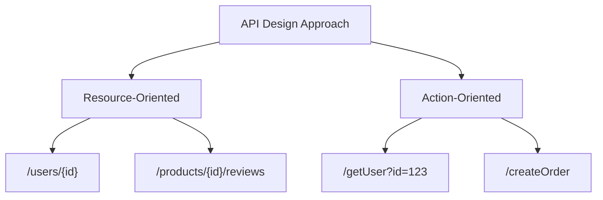
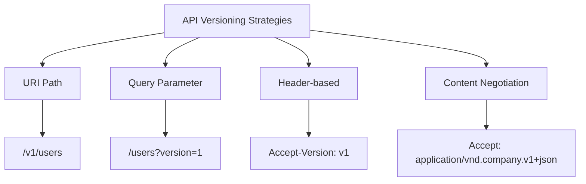
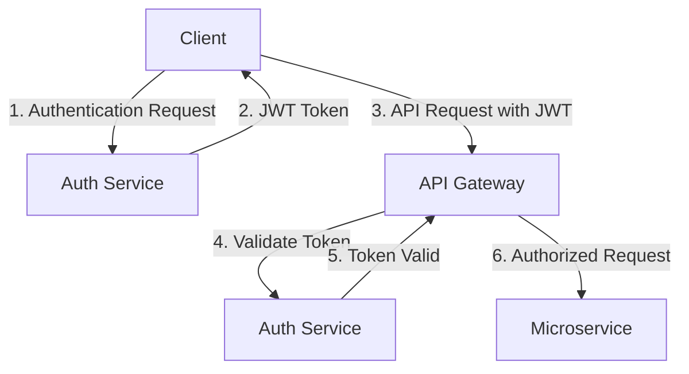

# API Design Principles: Building Robust and Developer-Friendly Interfaces

## Introduction

Application Programming Interfaces (APIs) are the backbone of modern software development, enabling seamless integration between different systems and services. Whether you're building RESTful APIs, GraphQL endpoints, or gRPC services, following solid design principles ensures your APIs are robust, maintainable, and developer-friendly.

This article explores key principles and best practices for designing APIs that stand the test of time.

## Core API Design Principles

### 1. Consistency

Consistency in API design creates predictability, making your API intuitive and reducing the learning curve for developers.

**Key aspects of consistency:**
- Uniform resource naming
- Consistent error handling
- Standardized data formats
- Predictable behavior across endpoints

**Example:** Consider these endpoint patterns:

```
# Consistent
GET /users
GET /products
POST /orders

# Inconsistent
GET /users
GET /get-products
POST /create-order
```

### 2. Resource-Oriented Design

For RESTful APIs, organize your API around resources (nouns) rather than actions (verbs).



**Good Practice:**
```
GET /users/{id}          # Get a user
POST /users              # Create a user
PUT /users/{id}          # Update a user
DELETE /users/{id}       # Delete a user
GET /users/{id}/orders   # Get orders for a user
```

### 3. Versioning Strategy

APIs evolve over time. Implement a versioning strategy to maintain backward compatibility while allowing innovation.

**Common versioning approaches:**



**Implementation Example:**
```javascript
// Express.js API with versioning
const express = require('express');
const app = express();

// Version 1 routes
const v1Router = express.Router();
v1Router.get('/users', (req, res) => {
  // v1 implementation
  res.json({ users: [{ id: 1, name: 'John' }] });
});

// Version 2 routes
const v2Router = express.Router();
v2Router.get('/users', (req, res) => {
  // v2 implementation with additional fields
  res.json({ users: [{ id: 1, name: 'John', email: 'john@example.com' }] });
});

// Mount the routers
app.use('/v1', v1Router);
app.use('/v2', v2Router);

app.listen(3000);
```

### 4. Error Handling

Implement consistent, informative error responses that help developers understand and resolve issues quickly.

**Example of a well-structured error response:**

```json
{
  "error": {
    "code": "VALIDATION_ERROR",
    "message": "The request parameters are invalid.",
    "details": [
      {
        "field": "email",
        "message": "Must be a valid email address"
      },
      {
        "field": "password",
        "message": "Must be at least 8 characters long"
      }
    ],
    "requestId": "f4f94162-c862-4d63-a67e-7fb5a0cee52c"
  }
}
```

### 5. Pagination, Filtering, and Sorting

For endpoints returning collections, implement standardized approaches for pagination, filtering, and sorting.

**Example:**
```
# Pagination
GET /products?limit=20&offset=40

# Filtering
GET /products?category=electronics&price_min=100&price_max=500

# Sorting
GET /products?sort=price:asc,rating:desc
```

**Implementation Example:**
```python
# Using FastAPI
from fastapi import FastAPI, Query
from typing import Optional, List

app = FastAPI()

@app.get("/products")
async def get_products(
    limit: int = Query(20, ge=1, le=100),
    offset: int = Query(0, ge=0),
    category: Optional[str] = None,
    price_min: Optional[float] = None,
    price_max: Optional[float] = None,
    sort: Optional[str] = None
):
    # Build query based on parameters
    query = {}
    if category:
        query["category"] = category
    if price_min is not None:
        query["price"] = {"$gte": price_min}
    if price_max is not None:
        query.setdefault("price", {})["$lte"] = price_max
    
    # Handle sorting
    sort_params = {}
    if sort:
        for sort_item in sort.split(","):
            field, direction = sort_item.split(":")
            sort_params[field] = 1 if direction == "asc" else -1
    
    # Execute query with pagination
    result = db.products.find(query).sort(sort_params).skip(offset).limit(limit)
    
    return {"items": list(result), "total": db.products.count_documents(query)}
```

## API Security Best Practices

Security should be a fundamental consideration in API design, not an afterthought.

### Authentication and Authorization



**Key security considerations:**
1. **Use HTTPS**: Always encrypt API traffic
2. **Implement Rate Limiting**: Protect against abuse and DoS attacks
3. **Validate Input**: Prevent injection attacks
4. **Use OAuth 2.0 or JWT**: For secure authentication
5. **Implement CORS**: Control cross-origin requests

**Example Rate Limiting Implementation:**
```javascript
// Using Express and rate-limit middleware
const rateLimit = require("express-rate-limit");

// Create limiter middleware
const apiLimiter = rateLimit({
  windowMs: 15 * 60 * 1000, // 15 minutes
  max: 100, // limit each IP to 100 requests per windowMs
  message: {
    error: {
      code: "RATE_LIMIT_EXCEEDED",
      message: "Too many requests, please try again later."
    }
  }
});

// Apply to all API routes
app.use("/api/", apiLimiter);
```

## Documentation

Great APIs are well-documented. Use tools like Swagger/OpenAPI, API Blueprint, or RAML to create interactive documentation.

**OpenAPI Example:**
```yaml
openapi: 3.0.0
info:
  title: Product API
  version: 1.0.0
  description: API for managing products
paths:
  /products:
    get:
      summary: Returns a list of products
      parameters:
        - name: limit
          in: query
          schema:
            type: integer
            default: 20
          description: Maximum number of items to return
        - name: offset
          in: query
          schema:
            type: integer
            default: 0
          description: Number of items to skip
      responses:
        '200':
          description: A JSON array of products
          content:
            application/json:
              schema:
                type: object
                properties:
                  items:
                    type: array
                    items:
                      $ref: '#/components/schemas/Product'
                  total:
                    type: integer
components:
  schemas:
    Product:
      type: object
      properties:
        id:
          type: string
        name:
          type: string
        price:
          type: number
        category:
          type: string
```

## Performance Considerations

Performance impacts user experience and can affect your infrastructure costs.

**Key performance optimizations:**
1. **Response Compression**: Reduce payload size
2. **Caching**: Implement HTTP caching headers
3. **Asynchronous Processing**: Use webhooks for long-running operations
4. **Field Selection**: Allow clients to request only needed fields
5. **Batch Operations**: Support processing multiple items in a single request

**Example HTTP Caching Headers:**
```
Cache-Control: max-age=3600, must-revalidate
ETag: "33a64df551425fcc55e4d42a148795d9f25f89d4"
```

## API Evolution and Deprecation

APIs need to evolve while maintaining backward compatibility. Establish clear processes for introducing changes and deprecating features.

**Best practices:**
1. Add new fields without removing existing ones
2. Introduce new endpoints for major changes
3. Use feature flags for gradual rollouts
4. Communicate deprecation timelines clearly
5. Monitor API usage to identify unused features

**Example Deprecation Header:**
```
Deprecation: true
Sunset: Sat, 31 Dec 2023 23:59:59 GMT
Link: <https://api.example.com/v2/users>; rel="successor-version"
```

## Conclusion

Designing great APIs requires balancing many considerations: usability, consistency, security, performance, and evolution. By following these principles, you'll create APIs that developers love to use and that stand the test of time.

Remember that API design is both an art and a science. While these principles provide a solid foundation, always consider your specific use cases and user needs when making design decisions.

## References

1. Masse, M. (2011). REST API Design Rulebook. O'Reilly Media.
2. Richardson, L., & Ruby, S. (2007). RESTful Web Services. O'Reilly Media.
3. Lauret, A. (2019). The Design of Web APIs. Manning Publications.
