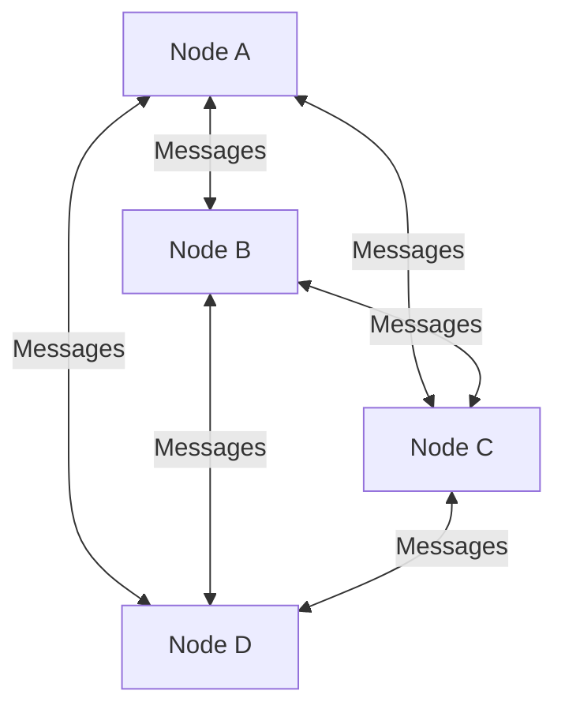
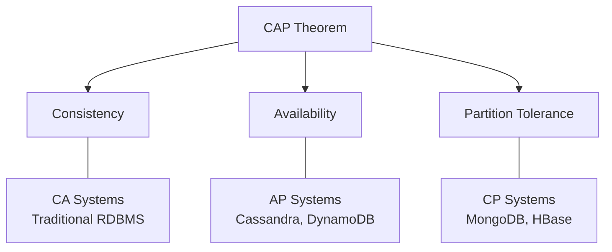
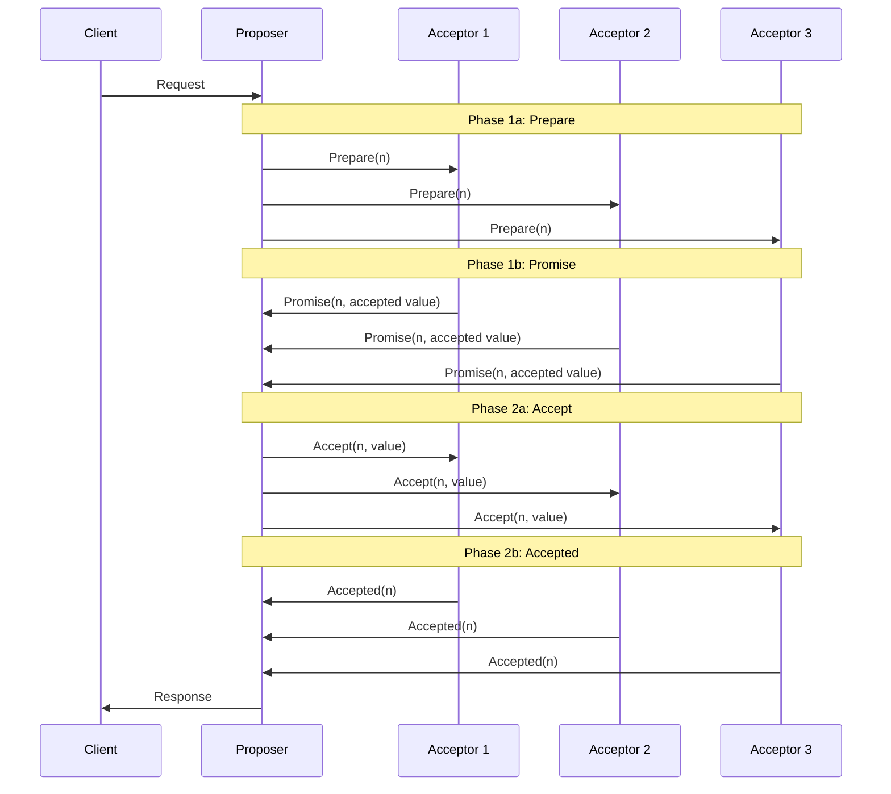
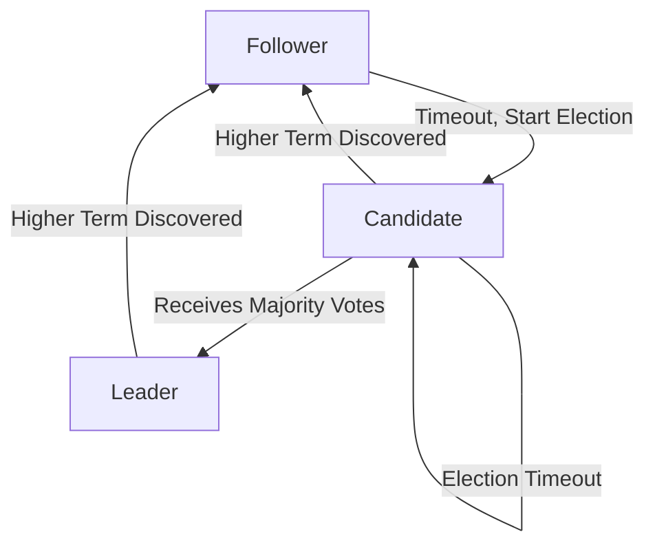
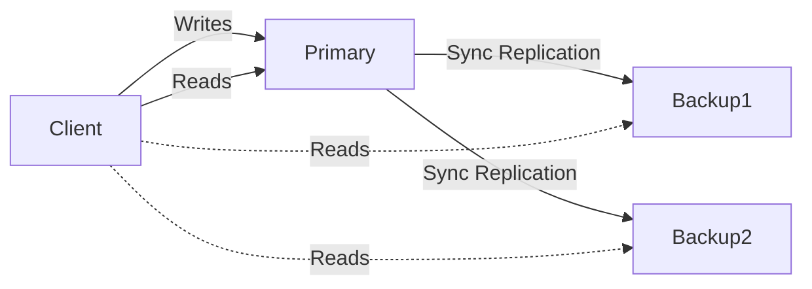
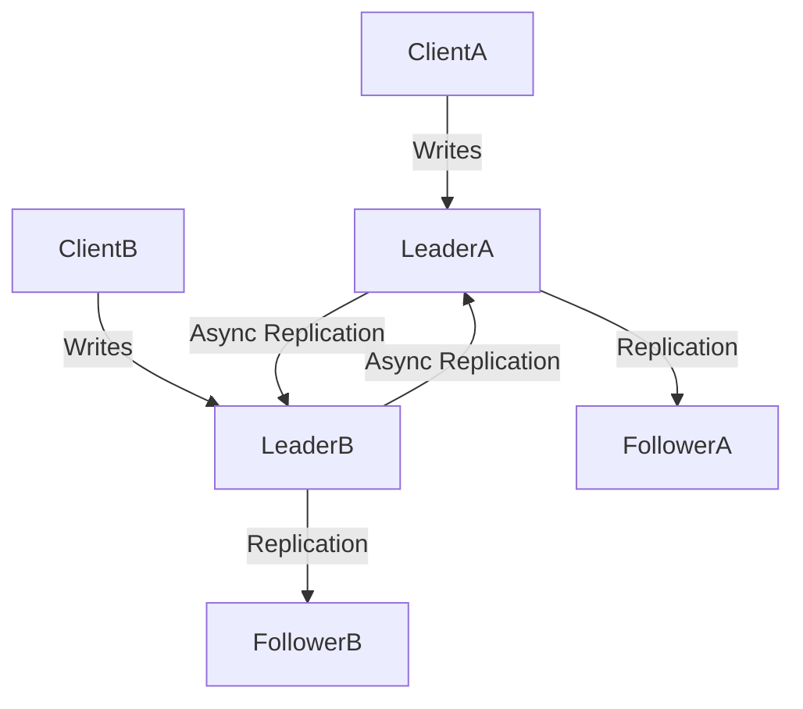
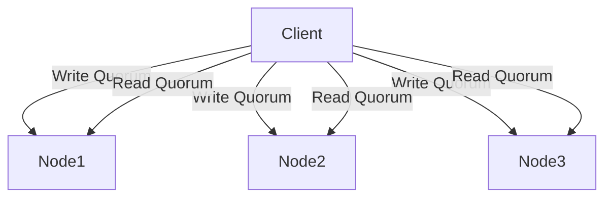
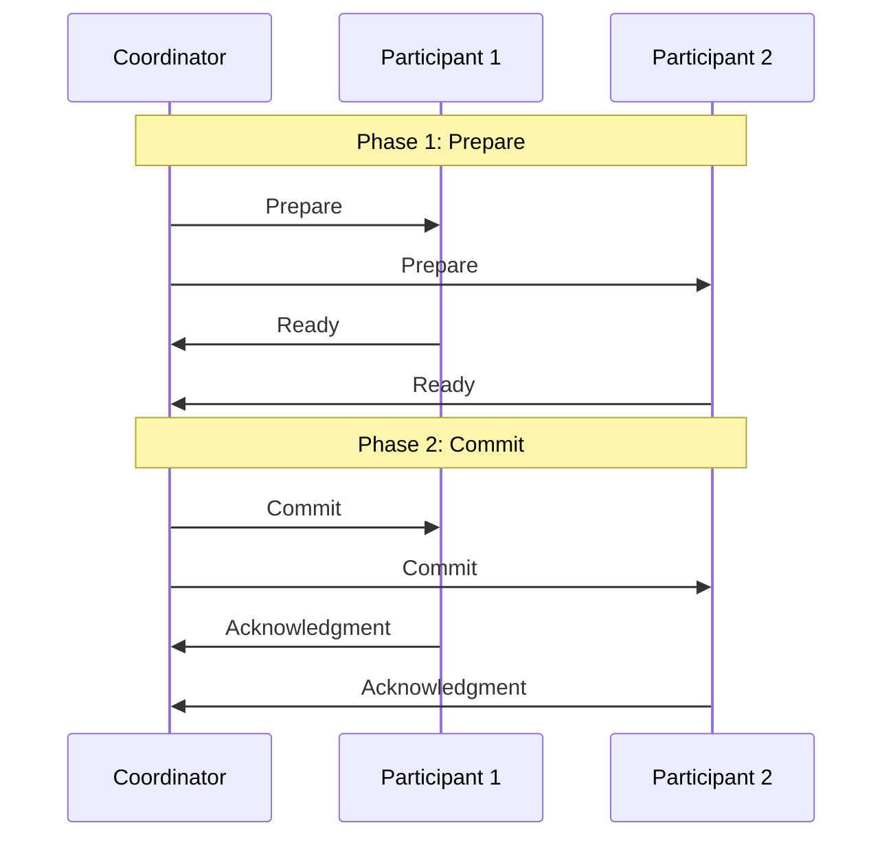
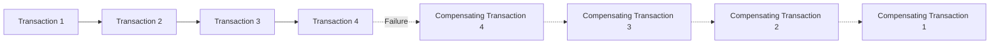
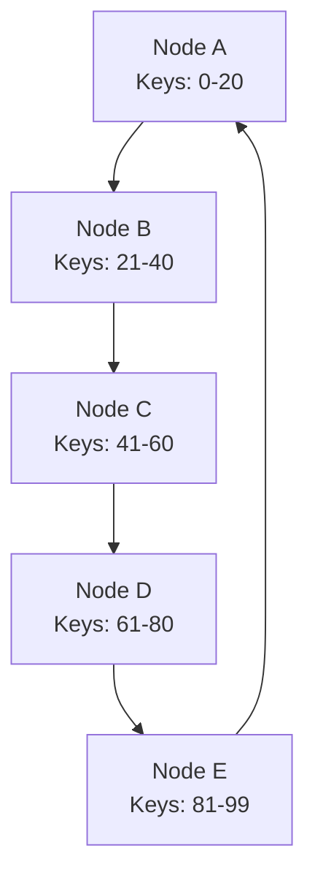

# Distributed Systems Fundamentals: Concepts and Challenges

## Introduction

Distributed systems are at the heart of modern computing infrastructure, powering everything from cloud services and social networks to financial systems and e-commerce platforms. These systems distribute computation across multiple machines to achieve greater scalability, reliability, and performance than single-machine solutions can provide.

However, distributed systems introduce significant complexity and unique challenges. This article explores the fundamental concepts and challenges in distributed systems design, providing a foundation for building robust distributed applications.

## Core Concepts in Distributed Systems

### What Makes a System "Distributed"?

A distributed system consists of multiple computing nodes that communicate and coordinate their actions by passing messages to achieve a common goal.



Key characteristics include:
- **Concurrency**: Components operate simultaneously
- **Lack of global clock**: No single source of time
- **Independent failures**: Components can fail independently
- **Message passing**: Communication via network

## The CAP Theorem

The CAP theorem, formulated by Eric Brewer, states that a distributed system cannot simultaneously provide more than two of these three guarantees:

- **Consistency**: All nodes see the same data at the same time
- **Availability**: Every request receives a response
- **Partition tolerance**: The system continues to operate despite network partitions



In practice, since network partitions are unavoidable in distributed systems, the real choice is between consistency and availability when partitions occur.

### Consistency Models

Distributed systems implement various consistency models, each with different guarantees:

1. **Strong Consistency**: All reads reflect the most recent write
2. **Eventual Consistency**: Given enough time without updates, all replicas will converge
3. **Causal Consistency**: Operations causally related must be seen in the same order by all nodes
4. **Session Consistency**: A client's reads will reflect its own writes

**Example: Implementing eventual consistency in a distributed key-value store**

```python
# Node receiving a write request
def handle_write(key, value, timestamp):
    # Only update if the incoming write is newer
    if timestamp > local_store[key].timestamp:
        local_store[key] = (value, timestamp)
        
    # Propagate to other nodes asynchronously
    for node in other_nodes:
        node.async_replicate(key, value, timestamp)

# Node receiving a replication message
def async_replicate(key, value, timestamp):
    # Apply the same logic - only update if newer
    if timestamp > local_store[key].timestamp:
        local_store[key] = (value, timestamp)
```

## Time and Ordering in Distributed Systems

Without a global clock, establishing event ordering is challenging.

### Logical Clocks

**Lamport Clocks** provide a partial ordering of events:

```python
# Simplified Lamport Clock implementation
class LamportClock:
    def __init__(self):
        self.counter = 0
        
    def increment(self):
        self.counter += 1
        return self.counter
        
    def update(self, received_time):
        self.counter = max(self.counter, received_time) + 1
        return self.counter
        
    def get_time(self):
        return self.counter

# Usage in message sending
def send_message(message, destination):
    message.timestamp = clock.increment()
    network.send(destination, message)
    
# Usage when receiving a message
def receive_message(message):
    clock.update(message.timestamp)
    process_message(message)
```

**Vector Clocks** capture causal relationships between events:

```python
# Simplified Vector Clock implementation
class VectorClock:
    def __init__(self, node_id, num_nodes):
        self.node_id = node_id
        self.clock = [0] * num_nodes
        
    def increment(self):
        self.clock[self.node_id] += 1
        return self.clock.copy()
        
    def update(self, received_clock):
        # Element-wise maximum
        for i in range(len(self.clock)):
            self.clock[i] = max(self.clock[i], received_clock[i])
        self.clock[self.node_id] += 1
        return self.clock.copy()
        
    def compare(self, other_clock):
        # Returns: -1 if happens before, 0 if concurrent, 1 if happens after
        less = False
        greater = False
        
        for i in range(len(self.clock)):
            if self.clock[i] < other_clock[i]:
                less = True
            elif self.clock[i] > other_clock[i]:
                greater = True
                
        if less and not greater:
            return -1  # happens before
        elif greater and not less:
            return 1   # happens after
        elif not less and not greater:
            return 0   # same time
        else:
            return 0   # concurrent events
```

## Consensus Algorithms

Consensus algorithms allow distributed systems to agree on values or states.

### Paxos

Paxos is a family of protocols for solving consensus in a network of unreliable processors.



### Raft

Raft is designed to be more understandable than Paxos, with a focus on leader election and log replication.



**Example: Simplified Raft Leader Election**

```go
// Simplified Raft leader election in Go
type RaftNode struct {
    id int
    currentTerm int
    votedFor int
    state string // "follower", "candidate", or "leader"
    nodes []Node
    electionTimeout time.Duration
    heartbeatTimer *time.Timer
}

func (n *RaftNode) startElection() {
    n.state = "candidate"
    n.currentTerm++
    n.votedFor = n.id
    
    votes := 1 // Vote for self
    
    // Send RequestVote RPCs to all other nodes
    for _, node := range n.nodes {
        if node.id == n.id {
            continue
        }
        
        // Asynchronously send RequestVote
        go func(node Node) {
            response := node.RequestVote(n.currentTerm, n.id, n.lastLogIndex, n.lastLogTerm)
            
            if response.Term > n.currentTerm {
                n.currentTerm = response.Term
                n.state = "follower"
                n.votedFor = -1
                return
            }
            
            if response.VoteGranted {
                votes++
                if votes > len(n.nodes)/2 {
                    n.becomeLeader()
                }
            }
        }(node)
    }
    
    // Reset election timeout
    n.resetElectionTimeout()
}

func (n *RaftNode) becomeLeader() {
    n.state = "leader"
    // Start sending heartbeats
    n.heartbeatTimer = time.AfterFunc(n.heartbeatInterval, n.sendHeartbeats)
}
```

## Replication Strategies

Replication improves availability and performance but introduces consistency challenges.

### Primary-Backup Replication



### Multi-Leader Replication



### Leaderless Replication



## Distributed Transactions

Distributed transactions ensure that operations across multiple nodes either all succeed or all fail.

### Two-Phase Commit (2PC)



**Example: Simplified 2PC Implementation**

```java
// Coordinator side
public boolean executeTransaction(Transaction txn, List<Participant> participants) {
    // Phase 1: Prepare
    for (Participant p : participants) {
        boolean ready = p.prepare(txn);
        if (!ready) {
            // If any participant cannot prepare, abort
            for (Participant p2 : participants) {
                p2.abort(txn);
            }
            return false;
        }
    }
    
    // Phase 2: Commit
    try {
        for (Participant p : participants) {
            p.commit(txn);
        }
        return true;
    } catch (Exception e) {
        // In a real system, recovery would be more complex
        return false;
    }
}

// Participant side
public boolean prepare(Transaction txn) {
    try {
        // Validate and lock resources
        acquireLocks(txn);
        validateTransaction(txn);
        writeToLog("PREPARED", txn);
        return true;
    } catch (Exception e) {
        return false;
    }
}

public void commit(Transaction txn) {
    try {
        // Apply changes
        applyChanges(txn);
        writeToLog("COMMITTED", txn);
    } finally {
        releaseLocks(txn);
    }
}

public void abort(Transaction txn) {
    try {
        // Rollback any changes
        rollback(txn);
        writeToLog("ABORTED", txn);
    } finally {
        releaseLocks(txn);
    }
}
```

### Saga Pattern

For long-running transactions, the Saga pattern provides a more flexible alternative:



## Partition Tolerance and Failure Detection

Distributed systems must handle network partitions and node failures.

### Failure Detectors

**Heartbeat-based detection:**

```python
class HeartbeatFailureDetector:
    def __init__(self, timeout=5.0):
        self.last_heartbeat = {}
        self.timeout = timeout
        self.suspected_nodes = set()
        
    def receive_heartbeat(self, node_id):
        self.last_heartbeat[node_id] = time.time()
        if node_id in self.suspected_nodes:
            self.suspected_nodes.remove(node_id)
            
    def check_nodes(self):
        now = time.time()
        for node_id, last_time in self.last_heartbeat.items():
            if now - last_time > self.timeout:
                self.suspected_nodes.add(node_id)
        return self.suspected_nodes
```

### Gossip Protocols

Gossip protocols disseminate information through a network by having nodes randomly exchange information:

```python
class GossipProtocol:
    def __init__(self, node_id, nodes):
        self.node_id = node_id
        self.nodes = nodes
        self.state = {}  # Local state
        
    def update_state(self, key, value):
        self.state[key] = (value, time.time())
        
    def gossip(self):
        # Select a random node to gossip with
        target = random.choice([n for n in self.nodes if n != self.node_id])
        
        # Send our state to the target
        target.receive_gossip(self.state)
        
    def receive_gossip(self, remote_state):
        # Merge remote state with our state, keeping newer values
        for key, (value, timestamp) in remote_state.items():
            if key not in self.state or timestamp > self.state[key][1]:
                self.state[key] = (value, timestamp)
```

## Distributed Data Structures

### Distributed Hash Tables (DHTs)

DHTs provide a scalable way to store and retrieve key-value pairs across a network:



### Conflict-Free Replicated Data Types (CRDTs)

CRDTs are data structures that can be replicated across multiple nodes, with updates applied independently and concurrently without coordination:

**Example: G-Counter (Grow-only Counter) CRDT**

```javascript
class GCounter {
    constructor(nodeId, numNodes) {
        this.nodeId = nodeId;
        this.counters = new Array(numNodes).fill(0);
    }
    
    // Local increment
    increment() {
        this.counters[this.nodeId]++;
    }
    
    // Merge with another G-Counter
    merge(other) {
        for (let i = 0; i < this.counters.length; i++) {
            this.counters[i] = Math.max(this.counters[i], other.counters[i]);
        }
    }
    
    // Get the total value
    value() {
        return this.counters.reduce((sum, val) => sum + val, 0);
    }
}
```

## Conclusion

Distributed systems offer powerful capabilities but come with significant challenges. Understanding these fundamental concepts is essential for designing robust distributed applications.

Key takeaways:
- The CAP theorem forces trade-offs between consistency and availability
- Time and ordering require special handling in distributed environments
- Consensus algorithms enable agreement in unreliable networks
- Replication strategies must balance consistency, availability, and performance
- Failure detection and handling are essential for resilience

As you design distributed systems, carefully consider your specific requirements and constraints to choose the appropriate patterns and algorithms.

## References

1. Lamport, L. (1978). Time, Clocks, and the Ordering of Events in a Distributed System. Communications of the ACM, 21(7), 558-565.
2. Brewer, E. (2012). CAP Twelve Years Later: How the "Rules" Have Changed. Computer, 45(2), 23-29.
3. Ongaro, D., & Ousterhout, J. (2014). In Search of an Understandable Consensus Algorithm. USENIX Annual Technical Conference.
4. Kleppmann, M. (2017). Designing Data-Intensive Applications. O'Reilly Media.
