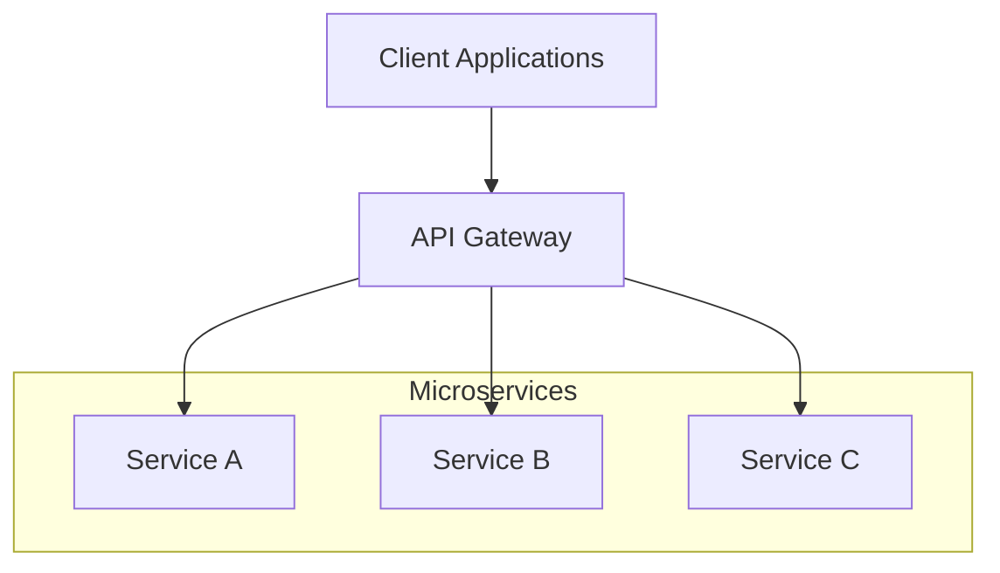
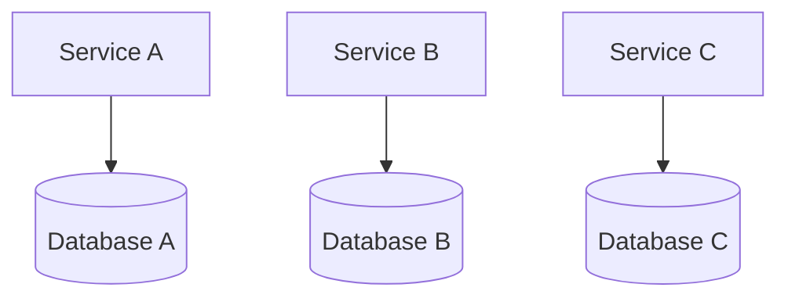
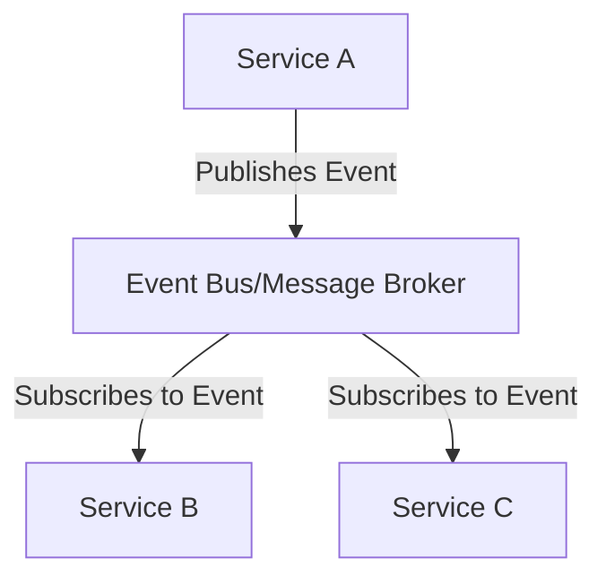
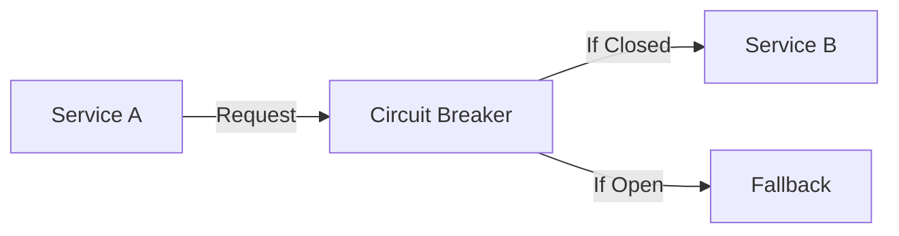
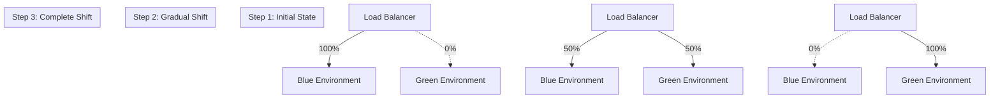
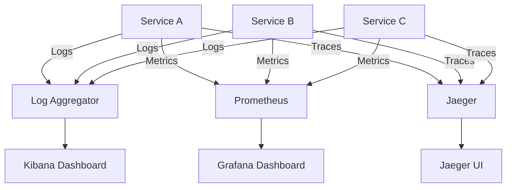

# Microservices Architecture: Design Patterns and Best Practices

## Introduction

Microservices architecture has become the de facto standard for building scalable, resilient, and maintainable applications. This architectural style structures an application as a collection of loosely coupled services, each implementing a specific business capability. In this article, we'll explore key design patterns and best practices for implementing effective microservices architectures.

## Core Principles of Microservices

Before diving into specific patterns, let's review the fundamental principles that guide microservices design:

1. **Single Responsibility**: Each service should focus on a single business capability
2. **Autonomy**: Services should be independently deployable and scalable
3. **Resilience**: System should be designed to handle partial failures gracefully
4. **Decentralization**: Avoid centralized governance and data management
5. **Observability**: Comprehensive monitoring and logging across services

## Key Design Patterns

### 1. API Gateway Pattern

The API Gateway serves as the entry point for client requests, routing them to appropriate microservices.



**Benefits:**
- Provides a unified entry point for clients
- Enables request routing, composition, and protocol translation
- Can implement cross-cutting concerns like authentication and rate limiting

**Implementation Example:**
```javascript
// Using Express.js as an API Gateway
const express = require('express');
const { createProxyMiddleware } = require('http-proxy-middleware');
const app = express();

// Authentication middleware
app.use((req, res, next) => {
  const token = req.headers.authorization;
  if (!validateToken(token)) {
    return res.status(401).send('Unauthorized');
  }
  next();
});

// Route to User Service
app.use('/users', createProxyMiddleware({ 
  target: 'http://user-service:8080',
  changeOrigin: true,
  pathRewrite: {'^/users': '/api/users'}
}));

// Route to Order Service
app.use('/orders', createProxyMiddleware({ 
  target: 'http://order-service:8081',
  changeOrigin: true,
  pathRewrite: {'^/orders': '/api/orders'}
}));

app.listen(3000, () => {
  console.log('API Gateway running on port 3000');
});
```

### 2. Database Per Service Pattern

Each microservice maintains its own database, ensuring loose coupling and autonomy.



**Benefits:**
- Services can choose the most appropriate database technology
- Changes to one service's data model don't impact other services
- Improved scalability and resilience

**Challenges:**
- Maintaining data consistency across services
- Implementing distributed transactions
- Handling joins across service boundaries

### 3. Event-Driven Communication Pattern

Services communicate asynchronously through events, reducing coupling and improving scalability.



**Implementation Example:**
```java
// Using Spring Cloud Stream with Kafka
@Service
public class OrderService {
    private final StreamBridge streamBridge;
    
    public OrderService(StreamBridge streamBridge) {
        this.streamBridge = streamBridge;
    }
    
    public void createOrder(Order order) {
        // Process order
        orderRepository.save(order);
        
        // Publish event
        OrderCreatedEvent event = new OrderCreatedEvent(order.getId(), order.getCustomerId());
        streamBridge.send("orderCreatedChannel", event);
    }
}

// In another service
@Service
public class NotificationService {
    @StreamListener(target = "orderCreatedChannel")
    public void handleOrderCreated(OrderCreatedEvent event) {
        // Send notification to customer
        sendNotification(event.getCustomerId(), "Your order has been created!");
    }
}
```

### 4. Circuit Breaker Pattern

Prevents cascading failures by detecting when a service is unavailable and providing fallback behavior.



**Implementation Example:**
```java
// Using Resilience4j in Spring Boot
@Service
public class ProductService {
    private final RestTemplate restTemplate;
    
    @CircuitBreaker(name = "inventoryService", fallbackMethod = "getDefaultInventory")
    public InventoryStatus getInventoryStatus(String productId) {
        return restTemplate.getForObject(
            "http://inventory-service/inventory/" + productId, 
            InventoryStatus.class
        );
    }
    
    public InventoryStatus getDefaultInventory(String productId, Exception e) {
        return new InventoryStatus(productId, "UNKNOWN", 0);
    }
}
```

## Deployment Strategies

Effective deployment is crucial for microservices. Here are key strategies:

### Blue-Green Deployment



### Canary Deployment

Gradually roll out changes to a small subset of users before full deployment.

## Observability

Monitoring and tracing are essential for microservices:

1. **Distributed Tracing**: Tools like Jaeger or Zipkin track requests across services
2. **Centralized Logging**: Aggregate logs from all services using ELK or Graylog
3. **Metrics Collection**: Monitor service health with Prometheus and Grafana



## Conclusion

Microservices architecture offers significant benefits for complex applications, but requires careful design and implementation. By applying these patterns and practices, you can build resilient, scalable, and maintainable microservices systems.

Remember that microservices aren't a silver bullet—they introduce complexity that may not be justified for simpler applications. Always evaluate whether the benefits outweigh the operational overhead for your specific use case.

## References

1. Newman, S. (2021). Building Microservices (2nd ed.). O'Reilly Media.
2. Richardson, C. (2018). Microservices Patterns. Manning Publications.
3. Fowler, M. & Lewis, J. (2014). Microservices: a definition of this new architectural term. https://martinfowler.com/articles/microservices.html
