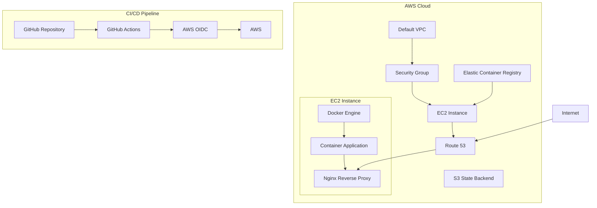
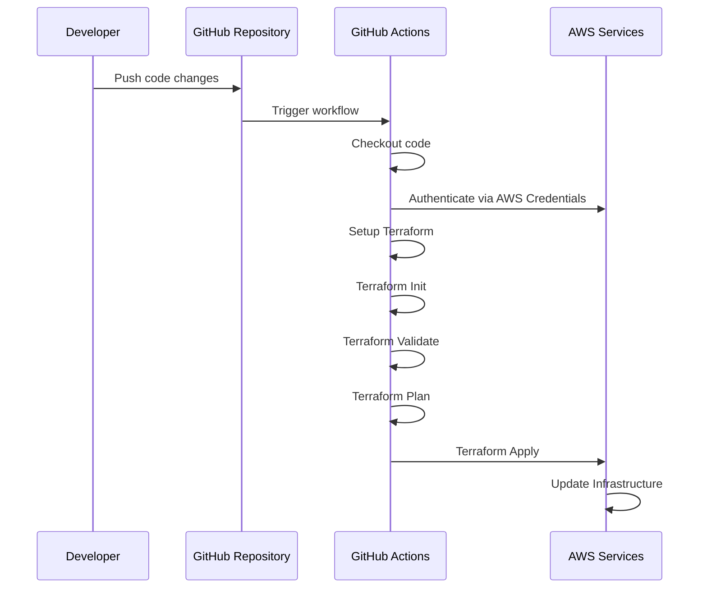
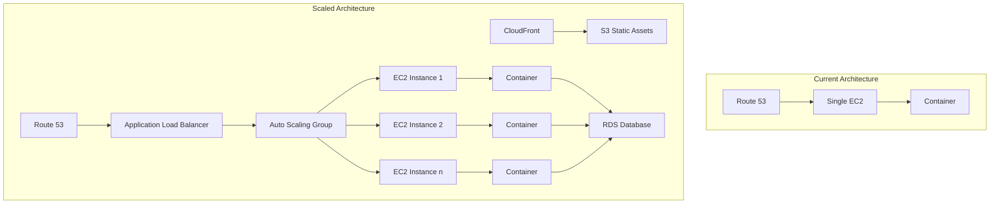

# Building a Scalable Web Infrastructure with Terraform and AWS

## Introduction

In today's cloud-first world, Infrastructure as Code (IaC) has become essential for managing and deploying reliable, repeatable, and scalable infrastructure. This blog post explores a practical implementation of IaC using Terraform to provision a complete web application hosting environment on AWS.

The project we'll examine, 'aash-infra', demonstrates how to create a production-ready infrastructure for hosting web applications with automated deployment pipelines, containerization, and proper security configurations.

## Architecture Overview

The infrastructure consists of several key components working together to provide a robust hosting environment:



## Core Infrastructure Components

### 1. Networking and Security

The project uses AWS's default VPC for simplicity but implements a custom security group that acts as a firewall to control inbound and outbound traffic:

```sh
resource "aws_security_group" "app_sg" {
  name_prefix = "${var.app_name}-sg-"
  description = "Allow web access (HTTP/HTTPS) and SSH"
  vpc_id      = data.aws_vpc.default.id

  # Inbound: HTTP (Port 80) from anywhere
  ingress {
    from_port   = 80
    to_port     = 80
    protocol    = "tcp"
    cidr_blocks = ["0.0.0.0/0"]
  }

  # Inbound: HTTPS (Port 443) from anywhere
  ingress {
    from_port   = 443
    to_port     = 443
    protocol    = "tcp"
    cidr_blocks = ["0.0.0.0/0"]
  }

  # Inbound: SSH (Port 22) from anywhere
  ingress {
    from_port   = 22
    to_port     = 22
    protocol    = "tcp"
    cidr_blocks = ["0.0.0.0/0"]
  }

  # Outbound: Allow all outbound traffic
  egress {
    from_port   = 0
    to_port     = 0
    protocol    = "-1"
    cidr_blocks = ["0.0.0.0/0"]
  }
}
```

**Security Considerations:**
- The security group allows HTTP (80), HTTPS (443), and SSH (22) traffic from any IP address
- In a production environment, SSH access should be restricted to specific IP ranges
- All outbound traffic is allowed, which is necessary for package updates and container pulls

### 2. Compute Resources

The project provisions an EC2 instance using the latest Amazon Linux 2 AMI:

```sh
resource "aws_instance" "app_server" {
  ami           = data.aws_ami.amazon_linux.id 
  instance_type = var.instance_type
  key_name      = var.ssh_key_name
  
  vpc_security_group_ids = [aws_security_group.app_sg.id]

  user_data = templatefile("${path.module}/config/nginx-config.sh", { 
    DOMAIN_NAME = var.domain_name 
  })
  
  associate_public_ip_address = true 

  tags = {
    Name = "${var.app_name}-server"
  }
}
```

**Key Features:**
- Uses a t2.micro instance by default (configurable via variables)
- Automatically assigns a public IP address
- Bootstraps the instance with a custom script that installs Docker and Nginx
- Associates the instance with the security group defined earlier

### 3. Container Registry

An Elastic Container Registry (ECR) repository is created to store Docker images:

```sh
resource "aws_ecr_repository" "app_repo" {
  name                 = var.app_name
  image_tag_mutability = "MUTABLE"
  force_delete         = true
}
```

This repository serves as the central storage for application container images, enabling:
- Version control for application deployments
- Secure storage of container images
- Integration with CI/CD pipelines

### 4. DNS Management

Route 53 is configured to manage DNS for the domain:

```sh
data "aws_route53_zone" "primary" {
  name         = "${var.domain_name}."
  private_zone = false
}

resource "aws_route53_record" "www" {
  zone_id = data.aws_route53_zone.primary.zone_id
  name    = var.domain_name
  type    = "A"
  ttl     = 300

  records = [aws_instance.app_server.public_ip] 
}
```

This configuration:
- Looks up an existing Route 53 hosted zone for the domain
- Creates an A record that points the domain to the EC2 instance's public IP
- Sets a TTL (Time to Live) of 300 seconds (5 minutes)

## Server Configuration

The EC2 instance is configured using a bootstrap script ('nginx-config.sh') that runs on first boot. This script:

1. Updates the system and installs necessary packages
2. Configures Docker and Nginx services
3. Generates a self-signed SSL certificate
4. Sets up Nginx as a reverse proxy

The Nginx configuration is particularly interesting:

```sh
# Server block for HTTP (Port 80)
server {
    listen 80 default_server;
    listen [::]:80 default_server;
    server_name ${DOMAIN_NAME} www.${DOMAIN_NAME};

    # Redirect all HTTP traffic to HTTPS
    return 301 https://$host$request_uri;
}

# Server block for HTTPS (Port 443)
server {
    listen 443 ssl http2 default_server;
    listen [::]:443 ssl http2 default_server;
    server_name ${DOMAIN_NAME} www.${DOMAIN_NAME};

    # SSL configuration
    ssl_certificate $CERT_FILE;
    ssl_certificate_key $KEY_FILE;
    ssl_session_cache shared:SSL:10m;
    ssl_protocols TLSv1.2 TLSv1.3;
    ssl_ciphers HIGH:!aNULL:!MD5;
    ssl_prefer_server_ciphers on;

    # Application Proxy
    location / {
        # Proxy traffic to the Docker container running on port 3000
        proxy_pass http://localhost:3000;
        proxy_http_version 1.1;
        proxy_set_header Upgrade $http_upgrade;
        proxy_set_header Connection 'upgrade';
        proxy_set_header Host $host;
        proxy_cache_bypass $http_upgrade;
        proxy_set_header X-Forwarded-Proto $scheme;
    }
}
```

This configuration:
- Redirects all HTTP traffic to HTTPS for enhanced security
- Uses modern TLS protocols (TLSv1.2 and TLSv1.3)
- Proxies all requests to a Docker container running on port 3000
- Properly handles WebSocket connections with the Upgrade headers

## CI/CD Pipeline

The project includes a GitHub Actions workflow ('infra-apply.yml') that automates infrastructure deployment:



The workflow:
1. Triggers on pushes to the main branch or manual execution
2. Authenticates with AWS using access keys
3. Sets up Terraform with a specific version
4. Initializes Terraform (connecting to the S3 backend)
5. Validates the Terraform configuration
6. Creates an execution plan
7. Applies the changes to the infrastructure

## State Management

Terraform state is stored remotely in an S3 bucket:

```sh
backend "s3" {
  bucket  = "aashishshenoy-terraform-state-bucket"
  key     = "dev/aashishshenoy-web-ec2.tfstate"
  region  = "us-east-1"
  encrypt = true
}
```

This approach provides several benefits:
- **State Locking**: Prevents concurrent modifications
- **Versioning**: Maintains a history of state changes
- **Security**: Encrypts sensitive data at rest
- **Collaboration**: Enables team-based infrastructure management

## Deployment Process

The complete deployment process follows these steps:

1. Infrastructure is provisioned via Terraform (either locally or through GitHub Actions)
2. The EC2 instance is bootstrapped with Docker and Nginx
3. Application container images are pushed to ECR
4. The application container is pulled and run on the EC2 instance
5. Nginx routes traffic from the internet to the application container

## Security Considerations

The infrastructure includes several security measures:

1. **HTTPS Enforcement**: All HTTP traffic is redirected to HTTPS
2. **Modern TLS**: Only TLSv1.2 and TLSv1.3 are enabled
3. **Secure Ciphers**: Weak ciphers are disabled
4. **State Encryption**: Terraform state is encrypted in S3
5. **Container Isolation**: Application runs in an isolated Docker container

Areas for improvement in a production environment:
- Restrict SSH access to specific IP ranges
- Use AWS Certificate Manager instead of self-signed certificates
- Implement a Web Application Firewall (WAF)
- Add VPC flow logs for network monitoring

## Scalability Considerations

While this infrastructure starts with a single EC2 instance, it can be scaled in several ways:

1. **Vertical Scaling**: Increase the EC2 instance size
2. **Horizontal Scaling**: 
   - Add an Auto Scaling Group
   - Implement an Application Load Balancer
3. **Database Scaling**: Add RDS for database needs
4. **Content Delivery**: Implement CloudFront for static assets



## Cost Optimization

The current setup is cost-effective for development and small production workloads:
- Uses t2.micro instances (eligible for AWS Free Tier)
- Leverages the default VPC (no additional charges)
- Minimizes data transfer costs by using a single region

For production environments, consider:
- Reserved Instances for predictable workloads
- Spot Instances for non-critical, interruptible workloads
- CloudFront to reduce data transfer costs
- Resource tagging for cost allocation

## Conclusion

This project demonstrates a practical implementation of Infrastructure as Code using Terraform and AWS. It provides a solid foundation for hosting web applications with:

- Automated infrastructure provisioning
- Containerized application deployment
- Secure HTTPS communication
- DNS management
- CI/CD integration

By leveraging these DevOps practices, development teams can focus on building features while maintaining confidence in their infrastructure's reliability, security, and scalability.

## Next Steps

To further enhance this infrastructure, consider:

1. Implementing monitoring with CloudWatch
2. Adding alerting with SNS
3. Setting up log aggregation with CloudWatch Logs
4. Implementing infrastructure testing with Terratest
5. Adding infrastructure documentation with Terraform-docs

By continuously improving your infrastructure code, you can build a robust, secure, and scalable platform for your applications.
