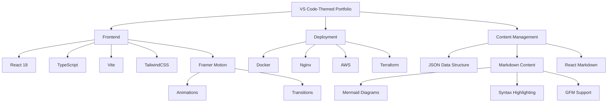
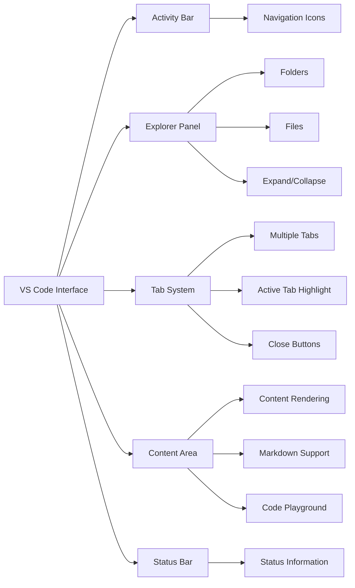
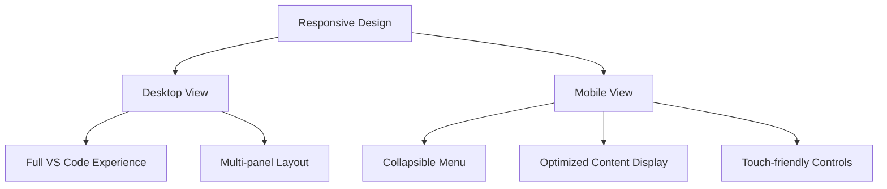
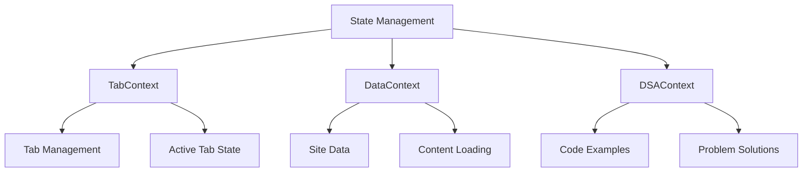
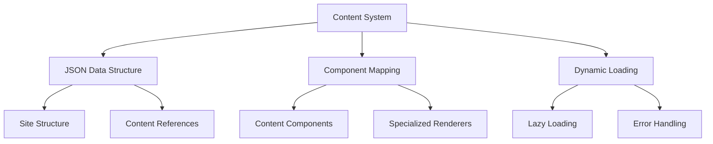
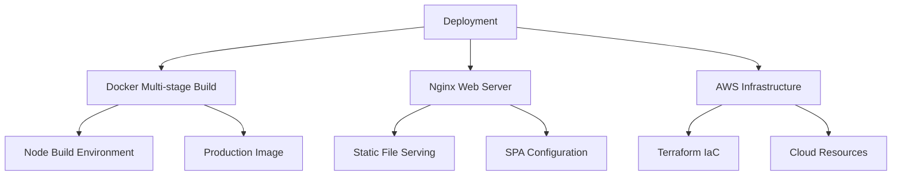

# Building a VS Code-Themed Portfolio Site

## Overview

This portfolio site is a unique showcase of technical skills, designed to mimic the Visual Studio Code interface while serving as a comprehensive portfolio. The project demonstrates expertise in modern web development technologies, UI/UX design principles, and software architecture.

## Architecture and Technology Stack

The site is built using a modern frontend stack with several key technologies:

### Core Technologies

- **React 18**: Provides the foundation for the component-based UI architecture
- **TypeScript**: Ensures type safety and improves developer experience
- **Vite**: Offers fast build times and efficient development experience
- **TailwindCSS**: Enables rapid UI development with utility-first approach
- **Framer Motion**: Powers smooth animations and transitions throughout the site

### Additional Libraries

- **React Router DOM**: Handles client-side routing and navigation
- **Monaco Editor**: Powers the code playground functionality
- **Pyodide**: Enables in-browser Python execution
- **React Markdown**: Renders markdown content with syntax highlighting
- **Lucide React**: Provides consistent, customizable icons

## Design Features

### VS Code-Inspired Interface

The site faithfully recreates the Visual Studio Code interface with several key components:

### Key UI Components

1. **Activity Bar**: Navigation sidebar with icons for different sections
2. **Explorer Panel**: Collapsible file tree showing content organization
3. **Tab System**: Multi-tab interface for viewing different content simultaneously
4. **Content Area**: Main display area for portfolio content
5. **Search Functionality**: Expandable search bar in the tab area

## Implementation Highlights

### Responsive Design

The site is fully responsive, with a specialized mobile interface that transforms the VS Code experience for smaller screens:

### State Management

The application uses React's Context API for state management across components:

### Content Rendering System

The site employs a flexible content rendering system that supports various content types:

## Deployment Architecture

The site is containerized using Docker and deployed with a multi-stage build process:

### Docker Configuration

- **Stage 1**: Node.js environment for building the React application
- **Stage 2**: Nginx server for hosting the static files
- **Benefits**: Smaller production image, separation of concerns

## Future Enhancements

The site is designed to be extensible, with several planned enhancements:

1. **Enhanced Code Playground**: More language support and features
2. **Interactive Resume**: Visual timeline of experience and skills
3. **Dark/Light Theme Toggle**: Support for different color schemes
4. **Performance Optimizations**: Further code splitting and lazy loading
5. **Accessibility Improvements**: Enhanced keyboard navigation and screen reader support

## Conclusion

This VS Code-themed portfolio site demonstrates the power of combining familiar interfaces with modern web technologies. By mimicking the popular code editor, it creates an engaging experience for technical audiences while showcasing development skills and project information in an intuitive format.

The project serves as both a portfolio and a technical demonstration, highlighting expertise in frontend development, UI design, and software architecture.
